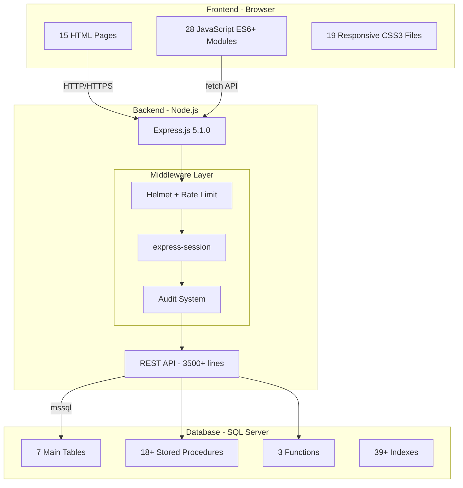
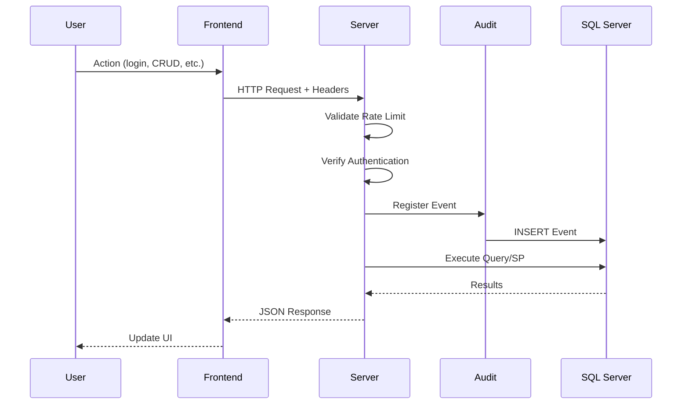
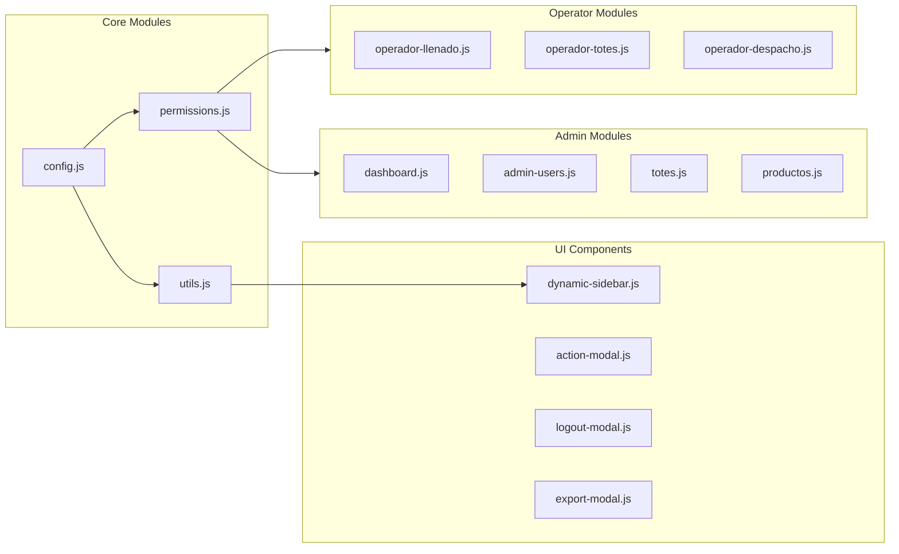

DitzlerTotes is built on a modern three-tier architecture with Express.js backend, vanilla JavaScript frontend, and SQL Server database. The system handles over 3,500 lines of API code across 15 pages and 28 JavaScript modules.

## Technology Stack

<CardGroup cols={3}>
  <Card title="Frontend" icon="browser">
    - HTML5, CSS3, JavaScript ES6+
    - 15 application pages
    - 28 modular JavaScript files
    - 19 responsive CSS files
  </Card>
  <Card title="Backend" icon="server">
    - Node.js + Express 5.1.0
    - Modular architecture (Routes → Controllers → Services)
    - 3,500+ lines of API code
    - Comprehensive middleware layer
  </Card>
  <Card title="Database" icon="database">
    - Microsoft SQL Server 2016+
    - 7 main tables with 39+ indexes
    - 18+ stored procedures
    - 3 custom functions
  </Card>
</CardGroup>

## System Architecture Diagram

The system follows a clear separation of concerns with distinct layers for presentation, business logic, and data access:



## Request Flow

Every request flows through multiple security and auditing layers before reaching business logic:



## Backend Architecture

### Modular Structure

The backend follows a clean modular architecture pattern:

```
server.js (Entry Point)
├── config/
│   └── database.js          # SQL Server connection pooling
├── middleware/
│   ├── audit.js             # Centralized audit logging
│   ├── security.js          # Helmet, rate limiting
│   └── jwt.js               # JWT token management
├── routes/
│   ├── auth.routes.js       # Authentication endpoints
│   ├── totes.routes.js      # Tote management
│   ├── users.routes.js      # User administration
│   └── [11 more modules]    # Specialized route handlers
├── services/
│   ├── auth.service.js      # Business logic for auth
│   ├── totes.service.js     # Tote management logic
│   └── [9 more services]    # Domain-specific logic
└── utils/
    └── helpers.js           # Shared utilities
```

<Note>
The system is currently in migration from legacy monolithic routes to the new modular architecture. See server.js:111 for legacy routes that are pending migration.
</Note>

### Database Connection Pool

The system uses a sophisticated connection pooling strategy defined in config/database.js:

```javascript
const sqlConfig = {
    pool: {
        max: 10,              // Maximum connections
        min: 0,               // Minimum idle connections
        idleTimeoutMillis: 30000  // 30 second timeout
    },
    options: {
        connectTimeout: 60000,
        requestTimeout: 60000,
        enableArithAbort: true
    }
};
```

**Key Features:**
- Global shared pool for frequent operations (middleware/audit.js:128)
- Dedicated connections for transactional operations
- Automatic connection cleanup in finally blocks
- Safe close operations that prevent global pool termination

## Frontend Architecture

The frontend is organized into modular JavaScript components with clear separation of concerns:



### Session Management

Frontend session configuration (js/config.js):

```javascript
const CONFIG = {
  SESSION: {
    STORAGE_KEY: 'loggedInAdmin',
    TIMEOUT: 8 * 60 * 60 * 1000  // 8 hours
  },
  API: {
    BASE_URL: '',
    TIMEOUT: 10000
  },
  UI: {
    ITEMS_PER_PAGE: 50,
    REFRESH_INTERVAL: 30000
  }
};
```

## Security Architecture

### Multi-Layer Security

Implemented in middleware/security.js:

<Steps>
  <Step title="HTTP Headers Protection">
    Helmet.js configured with CSP, HSTS, and security headers
    ```javascript
    helmet({
        contentSecurityPolicy: { /* ... */ },
        hsts: {
            maxAge: 31536000,
            includeSubDomains: true
        }
    })
    ```
  </Step>
  
  <Step title="Rate Limiting">
    Two-tier rate limiting strategy:
    - **Login endpoints**: 5 attempts per 15 minutes
    - **API endpoints**: 100 requests per minute
    
    See middleware/security.js:57-85
  </Step>
  
  <Step title="Secure Sessions">
    Express sessions with:
    - HTTP-only cookies
    - SameSite: strict
    - 24-hour expiration
    - HTTPS enforcement in production
  </Step>
  
  <Step title="Password Hashing">
    bcrypt 6.0.0 for password encryption with salt rounds
  </Step>
</Steps>

### Authentication Flow

The authentication process (services/auth.service.js:13-63) follows these steps:

1. **Credential Validation**: Email and password validated against database
2. **Status Check**: Only 'Activo' users can authenticate
3. **Role Processing**: Multi-role support with comma-separated roles
4. **Preference Loading**: User preferences loaded from JSON column
5. **JWT Generation**: Token generated with user data and preferences
6. **Audit Logging**: Login event recorded (middleware/audit.js:159-178)

```javascript
// services/auth.service.js:18-25
const result = await pool.request()
    .input('email', sql.VarChar, email)
    .input('password', sql.VarChar, password)
    .query(`
        SELECT Id, Nombre, Apellido, Email, Rol, Estado, Preferencias 
        FROM Usuarios 
        WHERE Email = @email AND Password = @password AND Estado = 'Activo'
    `);
```

## Audit System Architecture

### Centralized Auditing

The audit system (middleware/audit.js) provides comprehensive event logging:

<CodeGroup>
```javascript Event Structure
{
    tipoEvento: 'LOGIN | LOGOUT | CREATE | UPDATE | DELETE',
    modulo: 'USUARIOS | TOTES | CLIENTES',
    descripcion: 'Human-readable description',
    usuarioId: 123,
    usuarioNombre: 'John Doe',
    usuarioEmail: 'john@example.com',
    objetoId: '456',
    objetoTipo: 'Tote | Cliente | Usuario',
    valoresAnteriores: { /* before state */ },
    valoresNuevos: { /* after state */ },
    direccionIP: '192.168.1.1',
    userAgent: 'Mozilla/5.0...',
    exitoso: true,
    sesion: 'sess_1234567890_abc123'
}
```

```javascript Audit Middleware
// middleware/audit.js:133-156
auditMiddleware() {
    return (req, res, next) => {
        const clientInfo = this.getClientInfo(req);
        
        req.audit = {
            clientInfo,
            sessionId: req.session?.id || this.generateSessionId(),
            startTime: Date.now()
        };
        
        // Intercept response for timing
        const originalSend = res.send;
        res.send = function (data) {
            req.audit.endTime = Date.now();
            req.audit.responseTime = req.audit.endTime - req.audit.startTime;
            originalSend.call(this, data);
        };
        
        next();
    };
}
```
</CodeGroup>

### Event Types

The system tracks these event types (middleware/audit.js:13-31):

| Event Type | Mapped To | Use Case |
|------------|-----------|----------|
| CREATE | Creacion | New record creation |
| UPDATE | Actualizacion | Record modifications |
| DELETE | Eliminacion | Record deletion (soft delete) |
| LOGIN | Login | User authentication |
| LOGOUT | Logout | Session termination |
| ERROR | Error | System errors |
| VIEW | Configuracion | Data access tracking |

### Severity Levels

- **Debug**: Development/debugging information
- **Info**: Normal operations (default)
- **Warning**: Suspicious but non-critical events
- **Error**: Recoverable errors
- **Critical**: System-critical failures

## API Architecture

The REST API is organized into 15+ route modules, each handling a specific domain:

### Core API Modules

<AccordionGroup>
  <Accordion title="Authentication & Session" icon="key">
    **Routes**: `/api/login`, `/api/logout`, `/api/user/preferences`
    
    **Service**: services/auth.service.js
    
    Handles login, logout, JWT generation, and user preferences management.
  </Accordion>
  
  <Accordion title="Tote Management" icon="box">
    **Routes**: `/api/totes/*`, `/api/admin/totes`, `/api/operador/totes`
    
    **Service**: services/totes.service.js (755 lines)
    
    Comprehensive tote lifecycle management including:
    - CRUD operations
    - State transitions
    - Location tracking
    - Business rule application (services/totes.service.js:16-72)
  </Accordion>
  
  <Accordion title="Dashboard & Statistics" icon="chart-line">
    **Routes**: `/api/dashboard/*`, `/api/statistics/*`
    
    **Service**: services/dashboard.service.js
    
    Real-time KPIs, charts, and operational metrics.
  </Accordion>
  
  <Accordion title="Events & Audit" icon="clock-rotate-left">
    **Routes**: `/api/eventos/*`, `/api/movimientos/*`
    
    **Service**: services/events.service.js
    
    Audit log retrieval, event statistics, and movement history.
  </Accordion>
</AccordionGroup>

### Unified Route Pattern

Many modules support multiple URL patterns for backward compatibility:

```javascript
// server.js:74-79
const totesRoutes = require('./routes/totes.routes');
app.use('/api/totes', totesRoutes);
app.use('/api/admin/totes', totesRoutes);
app.use('/api/operador/totes', totesRoutes);
```

## Database Architecture

The database layer consists of 7 main tables with comprehensive indexing and stored procedures.

### Core Tables

<CardGroup cols={2}>
  <Card title="Usuarios" icon="users">
    **Purpose**: User management with multi-role support
    
    **Key Features**:
    - Multi-role support (comma-separated)
    - JSON preferences column
    - Soft delete support
    - 4 indexes
  </Card>
  
  <Card title="Totes" icon="box">
    **Purpose**: Container tracking and management
    
    **Key Features**:
    - State machine tracking
    - Location history
    - Client assignment
    - 11 indexes
    - Retail/tracking codes
  </Card>
  
  <Card title="Clientes" icon="building">
    **Purpose**: Customer/client management
    
    **Key Features**:
    - Contact information
    - Logo storage
    - Status tracking
    - 6 indexes
  </Card>
  
  <Card title="Eventos" icon="clock">
    **Purpose**: Comprehensive audit logging
    
    **Key Features**:
    - Full event tracking
    - Performance metrics
    - JSON additional data
    - 10 indexes
  </Card>
</CardGroup>

### Custom Functions

Three utility functions provide business logic at the database level:

| Function | Purpose | Usage |
|----------|---------|-------|
| `FN_ValidarEmail` | Email format validation | User management |
| `FN_GenerarCodigoTote` | Generate unique TOTE-XXXX codes | Tote creation |
| `FN_GenerarCodigoRetail` | Generate retail codes | Retail operations (services/totes.service.js:195) |
| `FN_GenerarCodigoSeguimiento` | Generate tracking codes | Product tracking (services/totes.service.js:293) |
| `FN_DiasHastaVencimiento` | Calculate days until expiration | Alert system |

### Stored Procedures

The system uses 18+ stored procedures for complex operations:

- **SP_RegistrarEvento**: Centralized event logging (middleware/audit.js:119)
- **SP_BuscarTotes**: Advanced tote search with filters (services/totes.service.js:654)
- **SP_LimpiarEventosAntiguos**: Maintenance cleanup

## Performance Considerations

<Warning>
**Connection Pool Management**: The system uses both shared and dedicated connection pools. Ensure proper cleanup in finally blocks to prevent connection leaks (config/database.js:55-63).
</Warning>

### Optimization Strategies

1. **Database Indexing**: 39+ indexes across tables for query optimization
2. **Connection Pooling**: Reusable connections with 30-second idle timeout
3. **Request Timeout**: 60-second timeout for long-running queries
4. **Rate Limiting**: Prevents API abuse and ensures fair resource allocation

### Monitoring Points

- CPU and memory usage
- API response times (tracked via audit middleware)
- Database connection count
- Event log growth rate
- Rate limit violations

## Deployment Architecture

### Environment Configuration

Required environment variables (.env):

```bash
# Database
DB_USER=usuario_sql
DB_PASSWORD=contraseña_sql
DB_DATABASE=Ditzler
DB_SERVER=localhost
DB_PORT=1433

# Server
PORT=3000

# Session Security
SESSION_SECRET=<generate-random-key>
```

<Tip>
Generate a secure session secret using:
```bash
node -e "console.log(require('crypto').randomBytes(64).toString('hex'))"
```
</Tip>

### Production Checklist

- [ ] Change default admin password
- [ ] Generate secure SESSION_SECRET
- [ ] Enable HTTPS
- [ ] Configure firewall rules
- [ ] Set NODE_ENV=production
- [ ] Review rate limit thresholds
- [ ] Configure database backups
- [ ] Set up monitoring

## Related Resources

<CardGroup cols={2}>
  <Card title="Roles & Permissions" icon="shield" href="/concepts/roles-and-permissions">
    Learn about the role-based access control system
  </Card>
  <Card title="Tote Lifecycle" icon="rotate" href="/concepts/tote-lifecycle">
    Understand tote state transitions and business rules
  </Card>
  <Card title="API Reference" icon="code" href="/api-reference/introduction">
    Complete API endpoint documentation
  </Card>
  <Card title="Deployment" icon="rocket" href="/deploy/docker">
    Deployment guides and best practices
  </Card>
</CardGroup>