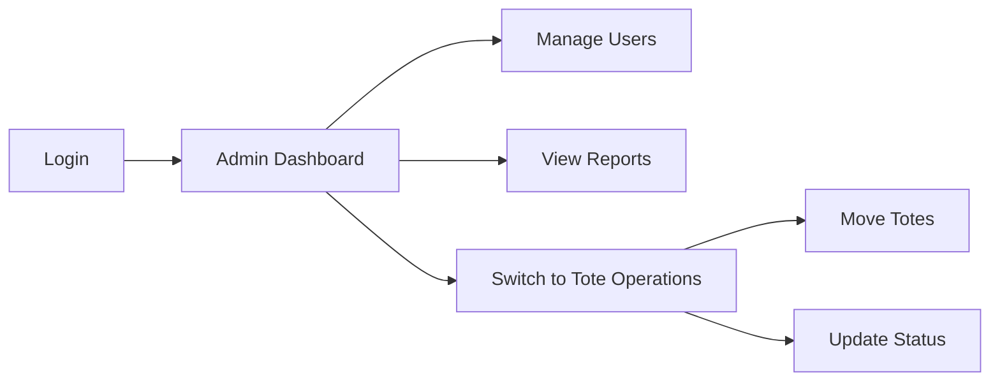

DitzlerTotes implements a sophisticated multi-role system that allows users to hold multiple operational roles simultaneously. This flexibility enables organizations to adapt to varying workforce needs, cross-training initiatives, and dynamic operational requirements.

## Overview

Unlike traditional single-role systems, DitzlerTotes allows comma-separated role assignments in a single field, providing:

<CardGroup cols={2}>
  <Card title="Operational Flexibility" icon="arrows-split-up-and-left">
    Users can perform multiple job functions without switching accounts
  </Card>
  <Card title="Cost Efficiency" icon="dollar-sign">
    Reduce the number of user accounts needed for cross-trained personnel
  </Card>
  <Card title="Simplified Management" icon="gears">
    Manage all roles from a single user record
  </Card>
  <Card title="Complete Audit Trail" icon="list-check">
    Track actions across all roles with unified user identity
  </Card>
</CardGroup>

## How Multi-Role Works

### Database Storage

Roles are stored as a comma-separated string in the `Usuarios.Rol` column:

```sql
CREATE TABLE Usuarios (
    Id INT PRIMARY KEY IDENTITY(1,1),
    Nombre NVARCHAR(100) NOT NULL,
    Apellido NVARCHAR(100) NOT NULL,
    Email NVARCHAR(255) UNIQUE NOT NULL,
    Rol NVARCHAR(500) NOT NULL,  -- Supports multiple roles
    Estado NVARCHAR(20) DEFAULT 'Activo',
    Preferencias NVARCHAR(MAX),  -- JSON configuration
    FechaCreacion DATETIME DEFAULT GETDATE()
);
```

### Example Multi-Role Values

```sql
-- Supervisor with admin and operational access
Rol = 'Administrador, Operador Totes'

-- Quality control with viewing and filling access
Rol = 'Visor, Operador de Llenado de Totes'

-- Warehouse manager with full operational control
Rol = 'Administrador, Operador Totes, Operador Despacho'

-- Cross-trained operator
Rol = 'Operador de Llenado de Totes, Operador Totes, Operador Despacho'
```

## Implementation Details

### Authentication Processing

The authentication service processes multi-role assignments during login:

<CodeGroup>
```javascript Login Query
// services/auth.service.js:18-25
const result = await pool.request()
    .input('email', sql.VarChar, email)
    .input('password', sql.VarChar, password)
    .query(`
        SELECT Id, Nombre, Apellido, Email, Rol, Estado, Preferencias 
        FROM Usuarios 
        WHERE Email = @email AND Password = @password AND Estado = 'Activo'
    `);
```

```javascript Role Detection
// services/auth.service.js:32-33
const user = result.recordset[0];
const isAdmin = user.Rol && 
    (user.Rol.includes('Admin') || user.Rol.includes('Administrador'));
```

```javascript User Object
// services/auth.service.js:42-50
const userData = {
    id: user.Id,
    username: user.Nombre,
    fullname: `${user.Nombre} ${user.Apellido}`,
    email: user.Email,
    role: user.Rol,  // Full comma-separated string
    isAdmin,
    preferences
};
```
</CodeGroup>

### Role Checking

The frontend and backend both use string inclusion checks for role validation:

```javascript
// Check if user has admin role
const isAdmin = user.role && 
    (user.role.includes('Administrador') || user.role.includes('Admin'));

// Check if user has specific operational role
const canFillTotes = user.role && 
    user.role.includes('Operador de Llenado de Totes');

// Check if user has any operator role
const isOperator = user.role && 
    (user.role.includes('Operador Totes') ||
     user.role.includes('Operador Despacho') ||
     user.role.includes('Operador de Llenado de Totes'));
```

<Warning>
**String Matching Caveat**: The current implementation uses `includes()` which is case-sensitive and substring-based. Be careful with role names that might partially match others.

**Safe**: "Administrador" vs "Operador"
**Risky**: "Admin" could match "Administrator" or "Admin_Legacy"
</Warning>

## Common Multi-Role Scenarios

### Scenario 1: Supervisor Role

**Business Need**: A floor supervisor needs to oversee operations and perform admin tasks.

**Role Assignment**:
```sql
UPDATE Usuarios 
SET Rol = 'Administrador, Operador Totes'
WHERE Email = 'supervisor@ditzler.com';
```

**Access Granted**:
- Full admin dashboard
- User management
- Tote operations panel
- Movement history
- System configuration

**Use Case**:


### Scenario 2: Quality Control

**Business Need**: QC personnel monitor all operations and occasionally perform filling tasks.

**Role Assignment**:
```sql
UPDATE Usuarios 
SET Rol = 'Visor, Operador de Llenado de Totes'
WHERE Email = 'qc@ditzler.com';
```

**Access Granted**:
- View-only dashboard
- All reports and statistics
- Filling operations panel
- Cannot modify users or configuration

### Scenario 3: Warehouse Manager

**Business Need**: Complete operational control across all warehouse functions.

**Role Assignment**:
```sql
UPDATE Usuarios 
SET Rol = 'Administrador, Operador Totes, Operador Despacho, Operador de Llenado de Totes'
WHERE Email = 'warehouse.mgr@ditzler.com';
```

**Access Granted**:
- Everything an administrator can do
- All three operator panels
- Complete operational flexibility

### Scenario 4: Cross-Trained Operator

**Business Need**: Operators trained on multiple stations to provide coverage flexibility.

**Role Assignment**:
```sql
UPDATE Usuarios 
SET Rol = 'Operador de Llenado de Totes, Operador Totes, Operador Despacho'
WHERE Email = 'operator@ditzler.com';
```

**Access Granted**:
- Filling operations
- Tote movement
- Dispatch operations
- No administrative functions

## Managing Multi-Role Users

### Creating Multi-Role Users

<Steps>
  <Step title="Create Base User">
    Create the user with initial role:
    ```sql
    INSERT INTO Usuarios (Nombre, Apellido, Email, Password, Rol, Estado)
    VALUES ('John', 'Doe', 'john.doe@ditzler.com', 'hashed_password', 'Visor', 'Activo');
    ```
  </Step>
  
  <Step title="Add Additional Roles">
    Update with comma-separated roles:
    ```sql
    UPDATE Usuarios 
    SET Rol = 'Visor, Operador Totes',
        FechaModificacion = GETDATE()
    WHERE Email = 'john.doe@ditzler.com';
    ```
  </Step>
  
  <Step title="Verify Access">
    Test login and verify all role functions are accessible
  </Step>
  
  <Step title="Audit Changes">
    Check audit log for the role change:
    ```sql
    SELECT * FROM Eventos 
    WHERE Modulo = 'USUARIOS' 
        AND JSON_VALUE(DatosAdicionales, '$.usuarioEmail') = 'john.doe@ditzler.com'
    ORDER BY FechaEvento DESC;
    ```
  </Step>
</Steps>

### Updating Roles

When updating roles, always use the complete role string:

<CodeGroup>
```sql Add Role
-- Adding 'Operador Despacho' to existing 'Administrador, Operador Totes'
UPDATE Usuarios 
SET Rol = 'Administrador, Operador Totes, Operador Despacho',
    FechaModificacion = GETDATE()
WHERE Id = @userId;
```

```sql Remove Role
-- Removing 'Operador Totes' from 'Administrador, Operador Totes, Operador Despacho'
UPDATE Usuarios 
SET Rol = 'Administrador, Operador Despacho',
    FechaModificacion = GETDATE()
WHERE Id = @userId;
```

```sql Change Completely
-- Replacing all roles
UPDATE Usuarios 
SET Rol = 'Visor',
    FechaModificacion = GETDATE()
WHERE Id = @userId;
```
</CodeGroup>

## User Interface Considerations

### Role Switcher

For users with multiple roles, the system should provide a role switcher interface:

```javascript
// Parse roles from user object
const roles = user.role.split(',').map(r => r.trim());

// Display role switcher if multiple roles
if (roles.length > 1) {
    displayRoleSwitcher(roles);
}

// Role switcher function
function displayRoleSwitcher(roles) {
    const rolePages = {
        'Administrador': '/pages/dashboard.html',
        'Visor': '/pages/dashboard.html',
        'Operador Totes': '/pages/operador-totes.html',
        'Operador Despacho': '/pages/operador-despacho.html',
        'Operador de Llenado de Totes': '/pages/operador-llenado.html'
    };
    
    // Create navigation menu with all accessible pages
    roles.forEach(role => {
        if (rolePages[role]) {
            addMenuItem(role, rolePages[role]);
        }
    });
}
```

### Navigation Customization

The sidebar should adapt based on all assigned roles:

```javascript
// Dynamic sidebar based on multi-role
function buildSidebar(user) {
    const roles = user.role.split(',').map(r => r.trim());
    const menuItems = [];
    
    // Add admin items if admin role present
    if (roles.some(r => r.includes('Administrador'))) {
        menuItems.push(
            { title: 'Dashboard', url: '/pages/dashboard.html' },
            { title: 'Users', url: '/pages/admin-users.html' },
            { title: 'Clients', url: '/pages/clientes.html' },
            { title: 'Totes', url: '/pages/totes.html' }
        );
    }
    
    // Add operator items
    if (roles.includes('Operador Totes')) {
        menuItems.push({ title: 'Tote Operations', url: '/pages/operador-totes.html' });
    }
    if (roles.includes('Operador Despacho')) {
        menuItems.push({ title: 'Dispatch', url: '/pages/operador-despacho.html' });
    }
    if (roles.includes('Operador de Llenado de Totes')) {
        menuItems.push({ title: 'Filling', url: '/pages/operador-llenado.html' });
    }
    
    return menuItems;
}
```

## Audit Trail

Multi-role users have a unified audit trail showing all actions across roles:

### Recording Multi-Role Actions

```javascript
// middleware/audit.js:199-217
async auditCreate(req, usuario, modulo, objetoTipo, objetoId, valoresNuevos, descripcion) {
    await this.logEvent({
        tipoEvento: 'CREATE',
        modulo,
        usuarioId: usuario.Id,
        usuarioNombre: usuario.fullname,
        usuarioEmail: usuario.Email,
        usuarioRol: usuario.Rol,  // Complete role string stored
        objetoId,
        objetoTipo,
        valoresNuevos,
        // ...
    });
}
```

### Querying Multi-Role Activity

<AccordionGroup>
  <Accordion title="All Actions by Multi-Role User" icon="list">
    ```sql
    SELECT 
        e.FechaEvento,
        e.Usuario,
        JSON_VALUE(e.DatosAdicionales, '$.usuarioRol') as Roles,
        e.Modulo,
        e.Accion,
        e.Descripcion
    FROM Eventos e
    WHERE JSON_VALUE(e.DatosAdicionales, '$.usuarioEmail') = 'supervisor@ditzler.com'
    ORDER BY e.FechaEvento DESC;
    ```
  </Accordion>
  
  <Accordion title="Actions by Specific Role Component" icon="filter">
    ```sql
    -- Find all actions by users who have 'Operador Totes' role
    SELECT 
        e.FechaEvento,
        e.Usuario,
        JSON_VALUE(e.DatosAdicionales, '$.usuarioRol') as Roles,
        e.Accion
    FROM Eventos e
    WHERE JSON_VALUE(e.DatosAdicionales, '$.usuarioRol') LIKE '%Operador Totes%'
    ORDER BY e.FechaEvento DESC;
    ```
  </Accordion>
  
  <Accordion title="Role Changes Over Time" icon="clock-rotate-left">
    ```sql
    -- Track role assignment changes
    SELECT 
        e.FechaEvento,
        e.Usuario,
        JSON_VALUE(e.DatosAdicionales, '$.valoresAnteriores') as OldRoles,
        JSON_VALUE(e.DatosAdicionales, '$.valoresNuevos') as NewRoles
    FROM Eventos e
    WHERE e.Modulo = 'USUARIOS'
        AND e.TipEvento = 'Actualizacion'
        AND e.DatosAdicionales LIKE '%Rol%'
    ORDER BY e.FechaEvento DESC;
    ```
  </Accordion>
</AccordionGroup>

## Security Considerations

### Privilege Escalation Prevention

<Warning>
**Admin Role Protection**: Users cannot modify their own roles if they don't have admin access. Only administrators can assign roles to users.
</Warning>

The system enforces role assignment restrictions:

```javascript
// Only admins can modify user roles
if (action === 'update' && req.body.rol) {
    // Verify requester has admin role
    const token = req.headers.authorization?.replace('Bearer ', '');
    const currentUser = await getUserFromToken(token);
    
    if (!currentUser.isAdmin) {
        return res.status(403).json({
            success: false,
            message: 'Insufficient permissions to modify roles'
        });
    }
}
```

### Root Admin Protection

The root administrator account has special protections:

```javascript
// services/auth.service.js:160-163
const ROOT_ADMIN_EMAIL = 'admin@ditzler.com';
if (user.Email === ROOT_ADMIN_EMAIL && 
    Array.isArray(mergedPrefs.excludedFunctions)) {
    // Prevent hiding user management from root admin
    mergedPrefs.excludedFunctions = 
        mergedPrefs.excludedFunctions.filter(f => f !== 'usuarios');
}
```

This prevents the root admin from:
- Losing access to user management
- Being locked out of the system
- Having critical functions hidden

## Best Practices

<AccordionGroup>
  <Accordion title="1. Use Descriptive Role Names" icon="tag">
    Keep role names clear and unambiguous:
    
    **Good**: `Operador de Llenado de Totes`, `Administrador`
    
    **Bad**: `Op1`, `Admin123`, `User`
  </Accordion>
  
  <Accordion title="2. Document Role Combinations" icon="book">
    Maintain documentation of common role combinations and their business purposes:
    
    ```markdown
    ## Standard Role Combinations
    
    - **Floor Supervisor**: Administrador, Operador Totes
    - **Quality Control**: Visor, Operador de Llenado de Totes
    - **Warehouse Manager**: Administrador, [All Operator Roles]
    - **Shift Lead**: Operador Totes, Operador Despacho
    ```
  </Accordion>
  
  <Accordion title="3. Regular Access Reviews" icon="clipboard-check">
    Periodically audit user role assignments:
    
    ```sql
    -- Users with 3+ roles
    SELECT 
        Email,
        Rol,
        LEN(Rol) - LEN(REPLACE(Rol, ',', '')) + 1 as RoleCount,
        FechaModificacion
    FROM Usuarios
    WHERE Estado = 'Activo'
        AND Rol LIKE '%,%,%'
    ORDER BY RoleCount DESC;
    ```
  </Accordion>
  
  <Accordion title="4. Test Role Combinations" icon="vial">
    Before deploying new role combinations to production:
    
    1. Create test user with the role combination
    2. Verify all expected functions are accessible
    3. Verify no unexpected functions are accessible
    4. Test navigation between role contexts
    5. Verify audit logging captures all actions correctly
  </Accordion>
  
  <Accordion title="5. Principle of Least Privilege" icon="shield">
    Start with minimal roles and add as needed:
    
    ```sql
    -- Start minimal
    INSERT INTO Usuarios (Nombre, Apellido, Email, Password, Rol, Estado)
    VALUES ('Jane', 'Smith', 'jane@ditzler.com', 'hashed', 'Operador Totes', 'Activo');
    
    -- Add roles as responsibilities grow
    UPDATE Usuarios 
    SET Rol = 'Operador Totes, Operador Despacho'
    WHERE Email = 'jane@ditzler.com';
    ```
  </Accordion>
</AccordionGroup>

## Migration Guide

### Converting Single-Role to Multi-Role

If migrating from a single-role system:

<Steps>
  <Step title="Backup Database">
    ```sql
    BACKUP DATABASE Ditzler TO DISK = 'C:\Backups\Ditzler_Before_MultiRole.bak';
    ```
  </Step>
  
  <Step title="Verify Column Size">
    ```sql
    -- Ensure Rol column can hold multiple roles (500 chars)
    ALTER TABLE Usuarios 
    ALTER COLUMN Rol NVARCHAR(500) NOT NULL;
    ```
  </Step>
  
  <Step title="Update Application Code">
    Replace exact role matches with substring checks:
    
    ```javascript
    // Old (exact match)
    if (user.role === 'Administrador') { ... }
    
    // New (substring match)
    if (user.role && user.role.includes('Administrador')) { ... }
    ```
  </Step>
  
  <Step title="Test Thoroughly">
    - Test single-role users (backward compatibility)
    - Test multi-role users (new functionality)
    - Verify audit logging
    - Test all navigation flows
  </Step>
</Steps>

## Troubleshooting

<AccordionGroup>
  <Accordion title="User Has Role But Cannot Access Function" icon="exclamation-triangle">
    **Possible Causes**:
    1. Typo in role name (case-sensitive)
    2. Extra spaces in comma-separated list
    3. Frontend not updated to check for role
    
    **Solution**:
    ```sql
    -- Check exact role value
    SELECT Id, Email, Rol, LEN(Rol) as RolLength
    FROM Usuarios
    WHERE Email = 'problematic@ditzler.com';
    
    -- Fix spacing issues
    UPDATE Usuarios
    SET Rol = REPLACE(REPLACE(Rol, ' ,', ','), ', ', ',')
    WHERE Email = 'problematic@ditzler.com';
    ```
  </Accordion>
  
  <Accordion title="Changes to Roles Not Taking Effect" icon="rotate">
    **Cause**: User session cached old role information
    
    **Solution**: 
    1. User must log out and log back in
    2. Or invalidate session server-side
    3. JWT tokens may need to expire (if using JWT)
  </Accordion>
  
  <Accordion title="Audit Log Not Showing All Roles" icon="list">
    **Cause**: Audit logging may store only primary role
    
    **Verification**:
    ```sql
    SELECT TOP 10
        Usuario,
        JSON_VALUE(DatosAdicionales, '$.usuarioRol') as StoredRol
    FROM Eventos
    WHERE Usuario = 'TestUser'
    ORDER BY FechaEvento DESC;
    ```
    
    The full role string should be stored in the JSON data.
  </Accordion>
</AccordionGroup>

## API Reference

### Get Current User Roles

```javascript
GET /api/user/current

Response:
{
  "success": true,
  "user": {
    "id": 5,
    "email": "supervisor@ditzler.com",
    "fullname": "John Supervisor",
    "role": "Administrador, Operador Totes",
    "roles": ["Administrador", "Operador Totes"],  // Parsed array
    "isAdmin": true
  }
}
```

### Update User Roles (Admin Only)

```javascript
POST /api/admin/users
{
  "action": "update",
  "id": 5,
  "rol": "Administrador, Operador Totes, Operador Despacho"
}

Response:
{
  "success": true,
  "message": "User updated successfully"
}
```

## Related Resources

<CardGroup cols={2}>
  <Card title="Roles & Permissions" icon="shield" href="/concepts/roles-and-permissions">
    Detailed role definitions and permission matrix
  </Card>
  <Card title="Architecture" icon="diagram-project" href="/concepts/architecture">
    System architecture and authentication flow
  </Card>
  <Card title="User Management API" icon="code" href="/api-reference/users">
    User management endpoint documentation
  </Card>
  <Card title="Security Best Practices" icon="lock" href="/security/best-practices">
    Security guidelines and recommendations
  </Card>
</CardGroup>