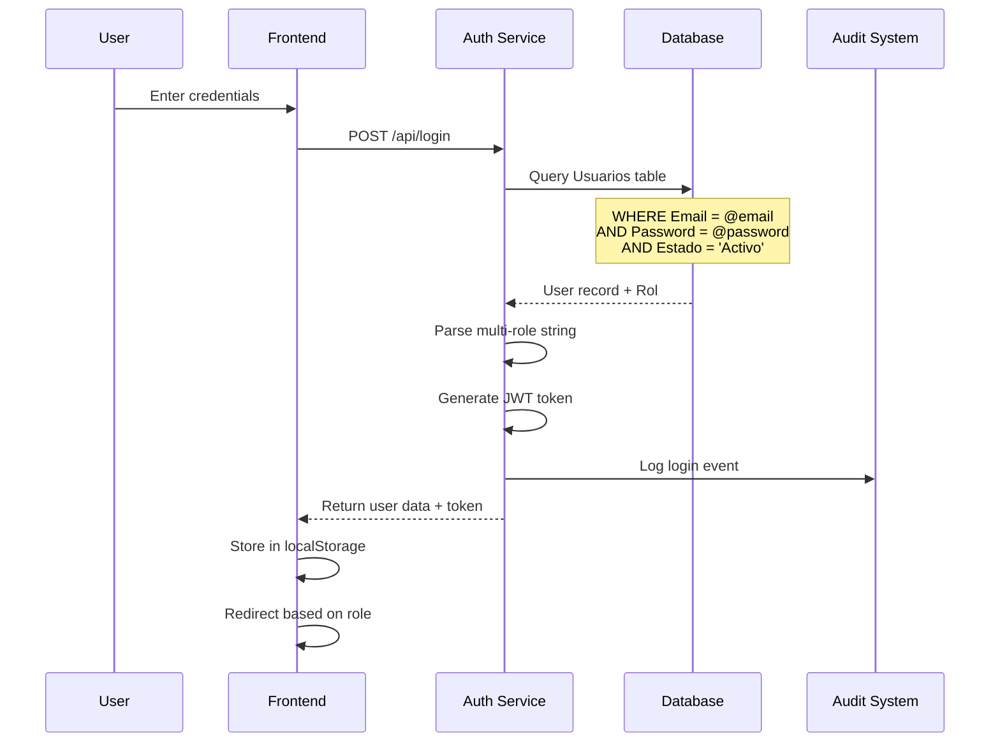
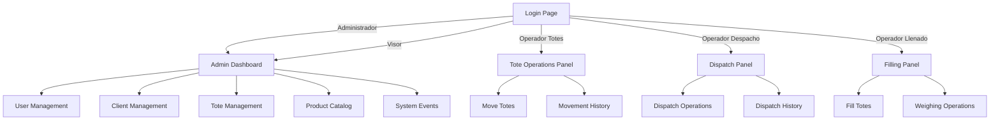

DitzlerTotes implements a flexible role-based access control (RBAC) system that supports multi-role assignments and granular permission management. The system is designed to handle diverse operational workflows while maintaining security and audit compliance.

## Role Overview

The system defines five primary roles, each with specific access rights and operational contexts:

<CardGroup cols={2}>
  <Card title="Administrador" icon="crown">
    **Full System Access**
    
    Complete control over all system functions, user management, configuration, and data.
  </Card>
  
  <Card title="Visor" icon="eye">
    **Read-Only Dashboard**
    
    View-only access to dashboard, reports, and system information without modification rights.
  </Card>
  
  <Card title="Operador Totes" icon="box">
    **Tote Operations**
    
    Specialized interface for tote movement, status updates, and location tracking.
  </Card>
  
  <Card title="Operador Despacho" icon="truck">
    **Dispatch Operations**
    
    Dispatch panel for client assignment, shipping preparation, and delivery tracking.
  </Card>
  
  <Card title="Operador de Llenado de Totes" icon="fill">
    **Filling Operations**
    
    Tote filling operations including product assignment, weighing, and lot management.
  </Card>
</CardGroup>

## Multi-Role Support

<Info>
The system supports assigning multiple roles to a single user, enabling flexible workforce management and cross-functional responsibilities.
</Info>

### How Multi-Role Works

Roles are stored as comma-separated values in the database and processed during authentication:

```javascript
// services/auth.service.js:32-33
const isAdmin = user.Rol && (user.Rol.includes('Admin') || user.Rol.includes('Administrador'));
```

### Database Storage

The `Usuarios` table stores roles in the `Rol` column (nvarchar(500)):

```sql
-- Example multi-role assignment
UPDATE Usuarios 
SET Rol = 'Administrador, Operador de Llenado de Totes'
WHERE Email = 'usuario@ditzler.com';
```

### Multi-Role Examples

<AccordionGroup>
  <Accordion title="Supervisor Role" icon="user-tie">
    **Combination**: Administrador + Operador Totes
    
    **Use Case**: Supervisors who need administrative access while also performing floor operations.
    
    ```sql
    Rol = 'Administrador, Operador Totes'
    ```
  </Accordion>
  
  <Accordion title="Quality Control Role" icon="clipboard-check">
    **Combination**: Visor + Operador de Llenado de Totes
    
    **Use Case**: QC personnel who monitor operations and perform filling tasks.
    
    ```sql
    Rol = 'Visor, Operador de Llenado de Totes'
    ```
  </Accordion>
  
  <Accordion title="Warehouse Manager" icon="warehouse">
    **Combination**: Administrador + Operador Totes + Operador Despacho
    
    **Use Case**: Warehouse managers with oversight and operational responsibilities.
    
    ```sql
    Rol = 'Administrador, Operador Totes, Operador Despacho'
    ```
  </Accordion>
</AccordionGroup>

## Role-Based Access Matrix

The following matrix defines access rights for each role:

### Administrative Functions

| Function | Admin | Visor | Op. Totes | Op. Despacho | Op. Llenado |
|----------|:-----:|:-----:|:---------:|:------------:|:-----------:|
| **User Management** | ✅ | ❌ | ❌ | ❌ | ❌ |
| **Client Management** | ✅ | 👁️ | ❌ | ❌ | ❌ |
| **Product Catalog** | ✅ | 👁️ | ❌ | ❌ | ❌ |
| **Location Management** | ✅ | 👁️ | ❌ | ❌ | ❌ |
| **Role Configuration** | ✅ | ❌ | ❌ | ❌ | ❌ |
| **System Events** | ✅ | 👁️ | ❌ | ❌ | ❌ |
| **Dashboard** | ✅ | 👁️ | ❌ | ❌ | ❌ |

### Operational Functions

| Function | Admin | Visor | Op. Totes | Op. Despacho | Op. Llenado |
|----------|:-----:|:-----:|:---------:|:------------:|:-----------:|
| **Create Totes** | ✅ | ❌ | ❌ | ❌ | ❌ |
| **Update Tote Status** | ✅ | ❌ | ✅ | ❌ | ❌ |
| **Move Totes** | ✅ | ❌ | ✅ | ❌ | ❌ |
| **Dispatch Operations** | ✅ | ❌ | ❌ | ✅ | ❌ |
| **Fill Totes** | ✅ | ❌ | ❌ | ❌ | ✅ |
| **View Movements** | ✅ | 👁️ | ✅ | ✅ | ✅ |
| **Export Data** | ✅ | ✅ | ❌ | ❌ | ❌ |

**Legend**: ✅ Full Access | 👁️ View Only | ❌ No Access

## Authentication Flow

The authentication process validates credentials and establishes user context:



### Login Implementation

The login service (services/auth.service.js:13-63) performs these operations:

<Steps>
  <Step title="Credential Validation">
    Query database for matching email and password:
    ```javascript
    const result = await pool.request()
        .input('email', sql.VarChar, email)
        .input('password', sql.VarChar, password)
        .query(`
            SELECT Id, Nombre, Apellido, Email, Rol, Estado, Preferencias 
            FROM Usuarios 
            WHERE Email = @email AND Password = @password AND Estado = 'Activo'
        `);
    ```
  </Step>
  
  <Step title="Role Processing">
    Determine admin status and parse multi-role assignments:
    ```javascript
    const isAdmin = user.Rol && 
        (user.Rol.includes('Admin') || user.Rol.includes('Administrador'));
    ```
  </Step>
  
  <Step title="Preference Loading">
    Load user preferences from JSON column:
    ```javascript
    let preferences = {};
    if (user.Preferencias) {
        try {
            preferences = JSON.parse(user.Preferencias);
        } catch (e) { }
    }
    ```
  </Step>
  
  <Step title="JWT Generation">
    Generate secure token with user context
  </Step>
  
  <Step title="Audit Logging">
    Record login event with IP and user agent (middleware/audit.js:159-178)
  </Step>
</Steps>

### Authentication Response

```json
{
  "success": true,
  "user": {
    "id": 1,
    "username": "Admin",
    "fullname": "Admin Sistema",
    "email": "admin@ditzler.com",
    "role": "Administrador",
    "isAdmin": true,
    "preferences": {
      "categoryOrder": [...],
      "excludedFunctions": []
    }
  },
  "token": "eyJhbGciOiJIUzI1NiIsInR5cCI6IkpXVCJ9..."
}
```

## Role-Based Routing

The system redirects users to appropriate interfaces based on their primary role:



## Permission Management

### User Preferences

Users can customize their interface through the preferences system (services/auth.service.js:95-131):

```javascript
// User preferences structure
{
  "categoryOrder": ["dashboard", "totes", "clients", "users"],
  "excludedFunctions": ["eventos", "productos"],
  "theme": "default",
  "itemsPerPage": 50
}
```

### Preference Storage

Preferences are stored as JSON in the Usuarios table:

```sql
-- Usuarios table structure (excerpt)
CREATE TABLE Usuarios (
    Id INT PRIMARY KEY IDENTITY(1,1),
    Nombre NVARCHAR(100) NOT NULL,
    Email NVARCHAR(255) UNIQUE NOT NULL,
    Rol NVARCHAR(500) NOT NULL,  -- Multi-role support
    Preferencias NVARCHAR(MAX),  -- JSON preferences
    Estado NVARCHAR(20) DEFAULT 'Activo'
);
```

### Admin Override

Administrators can manage preferences for any user:

```javascript
// services/auth.service.js:136-177
async function updatePreferencesByUserId(userId, newPreferences) {
    // Protection for root admin
    const ROOT_ADMIN_EMAIL = 'admin@ditzler.com';
    if (user.Email === ROOT_ADMIN_EMAIL && 
        Array.isArray(mergedPrefs.excludedFunctions)) {
        // Prevent hiding user management from root admin
        mergedPrefs.excludedFunctions = 
            mergedPrefs.excludedFunctions.filter(f => f !== 'usuarios');
    }
    // ...
}
```

<Warning>
**Root Admin Protection**: The system prevents the root admin (admin@ditzler.com) from hiding the user management function, ensuring system access cannot be completely locked out.
</Warning>

## Audit and Compliance

### Role-Based Audit Events

All actions are logged with complete role context:

```javascript
// middleware/audit.js:199-217
async auditCreate(req, usuario, modulo, objetoTipo, objetoId, valoresNuevos, descripcion) {
    await this.logEvent({
        tipoEvento: 'CREATE',
        modulo,
        descripcion,
        usuarioId: usuario.Id,
        usuarioNombre: usuario.fullname || `${usuario.Nombre} ${usuario.Apellido}`,
        usuarioEmail: usuario.Email,
        usuarioRol: usuario.Rol,  // Full role string
        objetoId: objetoId?.toString(),
        objetoTipo,
        valoresNuevos,
        direccionIP: clientInfo.ip,
        userAgent: clientInfo.userAgent,
        sesion: req.audit?.sessionId
    });
}
```

### Event Tracking by Role

The Eventos table captures role information for all operations:

```sql
-- Sample audit query
SELECT 
    e.FechaEvento,
    e.Usuario,
    JSON_VALUE(e.DatosAdicionales, '$.usuarioRol') as Rol,
    e.Modulo,
    e.Accion,
    e.Descripcion
FROM Eventos e
WHERE e.Modulo = 'USUARIOS'
ORDER BY e.FechaEvento DESC;
```

## Security Considerations

### Session Management

Configured in middleware/security.js:41-54:

```javascript
session({
    secret: process.env.SESSION_SECRET,
    resave: false,
    saveUninitialized: false,
    cookie: {
        secure: process.env.NODE_ENV === 'production',
        httpOnly: true,          // Prevent XSS
        maxAge: 24 * 60 * 60 * 1000,  // 24 hours
        sameSite: 'strict'       // CSRF protection
    }
})
```

### Rate Limiting

Role-independent rate limiting protects against brute force attacks:

<CodeGroup>
```javascript Login Rate Limit
// middleware/security.js:57-73
const loginLimiter = rateLimit({
    windowMs: 15 * 60 * 1000,  // 15 minutes
    max: 5,                     // 5 attempts
    message: {
        success: false,
        message: 'Too many login attempts. Try again in 15 minutes.'
    }
});
```

```javascript API Rate Limit
// middleware/security.js:76-85
const apiLimiter = rateLimit({
    windowMs: 1 * 60 * 1000,   // 1 minute
    max: 100,                   // 100 requests
    message: {
        success: false,
        message: 'Too many requests. Try again later.'
    }
});
```
</CodeGroup>

## User Status Management

Users can be in one of two states:

<Tabs>
  <Tab title="Activo">
    **Active State**
    
    - Can authenticate
    - All assigned roles functional
    - Appears in user lists
    - Actions logged normally
  </Tab>
  
  <Tab title="Inactivo">
    **Inactive State**
    
    - Cannot authenticate
    - Login attempts rejected
    - Hidden from operator selections
    - Previous audit logs retained
  </Tab>
</Tabs>

### Status Change Impact

```sql
-- Deactivate user
UPDATE Usuarios 
SET Estado = 'Inactivo', 
    FechaModificacion = GETDATE()
WHERE Id = @userId;

-- Reactivate user
UPDATE Usuarios 
SET Estado = 'Activo', 
    FechaModificacion = GETDATE()
WHERE Id = @userId;
```

## Best Practices

<AccordionGroup>
  <Accordion title="Principle of Least Privilege" icon="shield-halved">
    Assign only the minimum roles necessary for users to perform their job functions. Avoid giving Administrador access unnecessarily.
    
    **Example**: Warehouse floor workers should have Operador roles, not Administrador.
  </Accordion>
  
  <Accordion title="Regular Access Reviews" icon="clipboard-list">
    Periodically review user role assignments and remove obsolete or excessive permissions.
    
    ```sql
    -- Find users with multiple roles
    SELECT Email, Rol, FechaModificacion
    FROM Usuarios
    WHERE Rol LIKE '%,%'
    ORDER BY FechaModificacion DESC;
    ```
  </Accordion>
  
  <Accordion title="Audit Monitoring" icon="magnifying-glass">
    Regularly review the Eventos table for suspicious activity or unauthorized access attempts.
    
    ```sql
    -- Failed login attempts
    SELECT 
        JSON_VALUE(DatosAdicionales, '$.usuarioEmail') as Email,
        COUNT(*) as Attempts,
        MAX(FechaEvento) as LastAttempt
    FROM Eventos
    WHERE TipEvento = 'Login' 
        AND ResultadoExitoso = 0
        AND FechaEvento > DATEADD(day, -7, GETDATE())
    GROUP BY JSON_VALUE(DatosAdicionales, '$.usuarioEmail')
    ORDER BY Attempts DESC;
    ```
  </Accordion>
  
  <Accordion title="Secure Credential Storage" icon="lock">
    Always hash passwords using bcrypt. Never store plain text passwords.
    
    <Warning>
    The current implementation in services/auth.service.js:21 queries passwords directly. Ensure passwords are hashed before storage using bcrypt.
    </Warning>
  </Accordion>
  
  <Accordion title="Session Timeout" icon="clock">
    Configure appropriate session timeouts based on security requirements:
    - Admin: 8 hours (js/config.js)
    - Operators: Consider shorter timeouts for shared terminals
  </Accordion>
</AccordionGroup>

## API Endpoints

Role management is handled through these endpoints:

| Endpoint | Method | Role Required | Description |
|----------|--------|---------------|-------------|
| `/api/login` | POST | None | Authenticate user |
| `/api/logout` | POST | Any | End session |
| `/api/user/preferences` | GET | Any | Get own preferences |
| `/api/user/preferences` | PUT | Any | Update own preferences |
| `/api/admin/users` | POST | Administrador | User CRUD operations |
| `/api/admin/user-preferences` | PUT | Administrador | Update any user preferences |

## Related Resources

<CardGroup cols={2}>
  <Card title="Multi-Role Support" icon="users-gear" href="/concepts/multi-role-support">
    Deep dive into multi-role functionality and use cases
  </Card>
  <Card title="Architecture" icon="diagram-project" href="/concepts/architecture">
    Understand the overall system architecture
  </Card>
  <Card title="API Reference" icon="code" href="/api-reference/authentication">
    Authentication endpoint documentation
  </Card>
  <Card title="Audit System" icon="book" href="/concepts/architecture#audit-system-architecture">
    Learn about audit logging and compliance
  </Card>
</CardGroup>