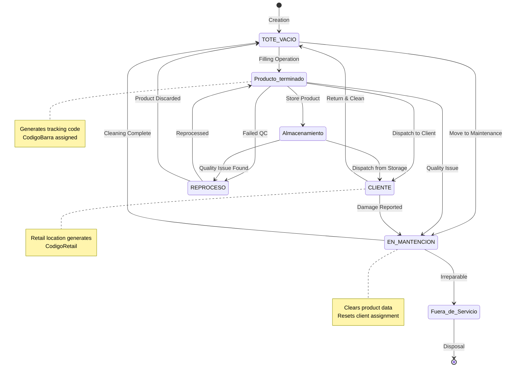

Totes in the DitzlerTotes system follow a complex lifecycle managed by a state machine with intelligent business rules. The system automatically applies state transitions, location-based rules, and tracking code generation based on operational context.

## Tote States Overview

The system recognizes multiple tote states, each representing a specific stage in the container lifecycle:

<CardGroup cols={3}>
  <Card title="TOTE VACIO" icon="box-open" color="#28a745">
    Empty, clean, ready for use
  </Card>
  <Card title="Producto terminado" icon="box" color="#17a2b8">
    Filled with product, ready for storage or dispatch
  </Card>
  <Card title="EN MANTENCION" icon="wrench" color="#ffc107">
    Undergoing maintenance, cleaning, or repair
  </Card>
  <Card title="REPROCESO" icon="recycle" color="#fd7e14">
    Product requires reprocessing
  </Card>
  <Card title="CLIENTE" icon="building" color="#6f42c1">
    Assigned to external client
  </Card>
  <Card title="Fuera de Servicio" icon="ban" color="#dc3545">
    Permanently out of service
  </Card>
</CardGroup>

## State Machine Diagram

The following diagram shows valid state transitions and the operations that trigger them:



## Business Rules Engine

The system implements sophisticated business rules that automatically manage tote states and properties based on location and context.

### Rule Processing

Implemented in services/totes.service.js:16-72:

```javascript
async function applyBusinessRules(pool, options = {}) {
    const { ubicacion, estado, cliente, isProductoTerminado = false } = options;
    const result = {
        nuevoEstado: estado,
        nuevoCliente: cliente,
        codigoRetail: null,
        codigoBarra: null,
        limpiarContenido: false
    };
    
    // Rules applied based on location...
}
```

### Core Business Rules

<AccordionGroup>
  <Accordion title="Rule 1: Maintenance Locations" icon="wrench">
    **Trigger**: Tote moved to location containing "LAVADO", "LIMPIEZA", or "MANTENCION"
    
    **Actions**:
    - Set state to `EN MANTENCION`
    - Clear client assignment
    - Clear product data (product, lote, peso)
    - Clear tracking codes
    
    **Implementation** (services/totes.service.js:30-34):
    ```javascript
    if (ubicacionUpper.includes('LAVADO') || 
        ubicacionUpper.includes('LIMPIEZA') || 
        ubicacionUpper.includes('MANTENCION')) {
        result.nuevoEstado = 'EN MANTENCION';
        result.nuevoCliente = null;
        result.limpiarContenido = true;
    }
    ```
  </Accordion>
  
  <Accordion title="Rule 2: Reprocessing" icon="recycle">
    **Trigger**: Tote moved to location containing "REPROCESO"
    
    **Actions**:
    - Set state to `REPROCESO`
    - Retain product information for reprocessing
    - Keep client assignment if exists
    
    **Implementation** (services/totes.service.js:36-38):
    ```javascript
    else if (ubicacionUpper.includes('REPROCESO')) {
        result.nuevoEstado = 'REPROCESO';
    }
    ```
  </Accordion>
  
  <Accordion title="Rule 3: Disposal/Discard" icon="trash">
    **Trigger**: Tote moved to location containing "DESECHO" or "DESECHADO"
    
    **Actions**:
    - Set state to `TOTE VACIO`
    - Clear all product data
    - Clear client assignment
    - Clear tracking codes
    
    **Implementation** (services/totes.service.js:40-43):
    ```javascript
    else if (ubicacionUpper.includes('DESECHO') || 
             ubicacionUpper.includes('DESECHADO')) {
        result.nuevoEstado = 'TOTE VACIO';
        result.limpiarContenido = true;
    }
    ```
  </Accordion>
  
  <Accordion title="Rule 4: Retail Code Generation" icon="barcode">
    **Trigger**: Tote moved to "Retail" location or client set to "Retail"
    
    **Actions**:
    - Generate unique retail code using `FN_GenerarCodigoRetail()`
    - Set client to "Retail"
    - Assign retail code to tote
    
    **Implementation** (services/totes.service.js:46-50):
    ```javascript
    else if (ubicacion === 'Retail' || 
             (cliente === 'Retail' && CLIENTES_INTERNOS.includes(ubicacion))) {
        const codeResult = await pool.request()
            .query('SELECT dbo.FN_GenerarCodigoRetail() as CodigoRetail');
        result.codigoRetail = codeResult.recordset[0].CodigoRetail;
        result.nuevoCliente = 'Retail';
    }
    ```
  </Accordion>
  
  <Accordion title="Rule 5: Storage Location" icon="warehouse">
    **Trigger**: Tote moved to "Almacenamiento" location
    
    **Actions**:
    - Clear client assignment (in storage, not with client)
    - Retain product information
    - Keep tracking codes
    
    **Implementation** (services/totes.service.js:52-54):
    ```javascript
    else if (ubicacion === 'Almacenamiento') {
        result.nuevoCliente = null;
    }
    ```
  </Accordion>
  
  <Accordion title="Rule 6: Internal Client Assignment" icon="building">
    **Trigger**: Tote moved to internal client location (Retail, Helados, Preparados, Trasvase, Almacenamiento)
    
    **Actions**:
    - Set client to location name
    - Maintain current state unless other rules override
    
    **Implementation** (services/totes.service.js:56-58):
    ```javascript
    else if (CLIENTES_INTERNOS.includes(ubicacion)) {
        result.nuevoCliente = ubicacion;
    }
    ```
  </Accordion>
  
  <Accordion title="Rule 7: External Client Assignment" icon="truck">
    **Trigger**: Tote moved to location starting with "Cliente:"
    
    **Actions**:
    - Parse client name from location string
    - Set state to `CLIENTE`
    - Assign client
    
    **Implementation** (services/totes.service.js:60-63):
    ```javascript
    else if (ubicacion.startsWith('Cliente:')) {
        result.nuevoCliente = ubicacion.replace('Cliente:', '').trim();
        result.nuevoEstado = 'CLIENTE';
    }
    ```
  </Accordion>
  
  <Accordion title="Rule 8: Tracking Code Generation" icon="qrcode">
    **Trigger**: Tote filled with product (estado = 'Producto terminado')
    
    **Actions**:
    - Generate unique tracking code using `FN_GenerarCodigoSeguimiento()`
    - Assign to `CodigoBarra` field
    - Enable end-to-end tracking
    
    **Implementation** (services/totes.service.js:66-69):
    ```javascript
    if (isProductoTerminado && estado === 'Producto terminado') {
        const trackingResult = await pool.request()
            .query('SELECT dbo.FN_GenerarCodigoSeguimiento() as CodigoSeguimiento');
        result.codigoBarra = trackingResult.recordset[0].CodigoSeguimiento;
    }
    ```
  </Accordion>
</AccordionGroup>

## Internal Client System

The system defines five internal clients for warehouse operations:

```javascript
// services/totes.service.js:10
const CLIENTES_INTERNOS = [
    'Retail',
    'Helados',
    'Preparados',
    'Trasvase',
    'Almacenamiento'
];
```

### Internal Client Usage

<Tabs>
  <Tab title="Retail">
    **Purpose**: Retail sales operations
    
    **Special Behavior**: Triggers retail code generation
    
    **Example**:
    ```javascript
    // Moving tote to Retail
    {
        codigo: 'TOTE-001',
        nuevaUbicacion: 'Retail'
    }
    // Result: CodigoRetail generated, Cliente set to 'Retail'
    ```
  </Tab>
  
  <Tab title="Helados">
    **Purpose**: Ice cream production line
    
    **Special Behavior**: Standard internal client processing
    
    **Example**:
    ```javascript
    {
        codigo: 'TOTE-002',
        nuevaUbicacion: 'Helados'
    }
    // Result: Cliente set to 'Helados'
    ```
  </Tab>
  
  <Tab title="Preparados">
    **Purpose**: Prepared products division
    
    **Special Behavior**: Standard internal client processing
  </Tab>
  
  <Tab title="Trasvase">
    **Purpose**: Transfer operations between containers
    
    **Special Behavior**: Standard internal client processing
  </Tab>
  
  <Tab title="Almacenamiento">
    **Purpose**: Storage/warehousing
    
    **Special Behavior**: Clears client assignment (in storage, not assigned)
    
    **Example**:
    ```javascript
    {
        codigo: 'TOTE-003',
        nuevaUbicacion: 'Almacenamiento'
    }
    // Result: Cliente set to NULL
    ```
  </Tab>
</Tabs>

## Tote Operations

### Filling Operation

The filling operation is the primary way to move a tote from empty to filled state:

<Steps>
  <Step title="Scan Empty Tote">
    Operator scans empty tote code (e.g., TOTE-001)
  </Step>
  
  <Step title="Select Product & Lot">
    Choose product from catalog and assign/generate lot number
    
    ```javascript
    {
        codigo: 'TOTE-001',
        producto: 'Jarabe de Chocolate',
        lote: 'LOTE-000123',
        peso: 250.5
    }
    ```
  </Step>
  
  <Step title="Weigh Tote">
    System records weight (gross, net, tare)
  </Step>
  
  <Step title="Generate Tracking Code">
    System automatically generates tracking code:
    
    ```javascript
    // services/totes.service.js:292-294
    if (nuevoEstado === 'Producto terminado' && !newCodigoBarra) {
        const trackingResult = await pool.request()
            .query('SELECT dbo.FN_GenerarCodigoSeguimiento() as CodigoSeguimiento');
        newCodigoBarra = trackingResult.recordset[0].CodigoSeguimiento;
    }
    ```
  </Step>
  
  <Step title="Update Tote Status">
    Tote status updated to 'Producto terminado' with all product data
  </Step>
  
  <Step title="Record Event">
    Event logged to Eventos table for traceability
  </Step>
</Steps>

### Movement Operation

Moving totes between locations triggers business rules:

```javascript
// services/totes.service.js:136-266
async function move(data) {
    const { toteId, codigo, nuevaUbicacion, operador, usuario, cliente } = data;
    
    // Get current tote state
    const tote = await getTote(toteId || codigo);
    
    // Apply business rules based on new location
    const ubicacionUpper = nuevaUbicacion.toUpperCase();
    
    if (ubicacionUpper.includes('LAVADO') || ubicacionUpper.includes('MANTENCION')) {
        // Clear content and set to maintenance
        await updateTote({
            estado: 'EN MANTENCION',
            cliente: null,
            producto: null,
            lote: null,
            peso: null,
            codigoBarra: null,
            codigoRetail: null
        });
    } else if (cliente === 'Retail') {
        // Generate retail code
        const codigoRetail = await generateRetailCode();
        await updateTote({ codigoRetail, cliente: 'Retail' });
    }
    // ... more rules
}
```

### Status Update Operation

Direct status updates for operational flexibility:

```javascript
// services/totes.service.js:271-423
async function updateStatus(data) {
    let { codigo, nuevoEstado, nuevaUbicacion, usuario, observaciones, 
          producto, cliente, lote, peso, codigoBarra, fechaRetorno } = data;
    
    // Auto-adjust state based on location
    if (nuevaUbicacion) {
        const ubicacionUpper = nuevaUbicacion.toUpperCase();
        if (ubicacionUpper.includes('LAVADO')) {
            nuevoEstado = 'EN MANTENCION';
        } else if (ubicacionUpper.includes('REPROCESO')) {
            nuevoEstado = 'REPROCESO';
        } else if (ubicacionUpper.includes('DESECHO')) {
            nuevoEstado = 'TOTE VACIO';
        }
    }
    
    // Generate tracking code if filling
    let newCodigoBarra = codigoBarra;
    if (nuevoEstado === 'Producto terminado' && !newCodigoBarra) {
        newCodigoBarra = await generateTrackingCode();
    }
    
    // Update tote fields
    await updateToteFields({ nuevoEstado, nuevaUbicacion, /* ... */ });
    
    // Clear content for emptying processes
    if (shouldClearContent(nuevaUbicacion, nuevoEstado)) {
        await clearToteContent(codigo);
    }
}
```

## Tracking Codes

The system uses two types of tracking codes:

### Tracking Code (CodigoBarra)

<Card title="Product Tracking Code" icon="qrcode">
  **Purpose**: End-to-end product traceability from filling to delivery
  
  **Generated When**: Tote is filled with product (estado = 'Producto terminado')
  
  **Format**: Sequential code from `FN_GenerarCodigoSeguimiento()`
  
  **Usage**: QR codes, barcode scanning, inventory tracking
  
  **Database Field**: `Totes.CodigoBarra`
</Card>

### Retail Code (CodigoRetail)

<Card title="Retail Location Code" icon="barcode">
  **Purpose**: Retail-specific identification for sales operations
  
  **Generated When**: Tote moved to 'Retail' location
  
  **Format**: Sequential code from `FN_GenerarCodigoRetail()`
  
  **Usage**: Point-of-sale systems, retail inventory
  
  **Database Field**: `Totes.CodigoRetail`
</Card>

### Code Generation Examples

<CodeGroup>
```javascript Tracking Code
// services/totes.service.js:292-294
if (nuevoEstado === 'Producto terminado' && !newCodigoBarra) {
    const trackingResult = await pool.request()
        .query('SELECT dbo.FN_GenerarCodigoSeguimiento() as CodigoSeguimiento');
    newCodigoBarra = trackingResult.recordset[0].CodigoSeguimiento;
}

// Result: CodigoBarra = 'SEG-000001', 'SEG-000002', etc.
```

```javascript Retail Code
// services/totes.service.js:193-195
if (nuevoCliente === 'Retail') {
    const codeResult = await pool.request()
        .query('SELECT dbo.FN_GenerarCodigoRetail() as CodigoRetail');
    codigoRetail = codeResult.recordset[0].CodigoRetail;
}

// Result: CodigoRetail = 'RET-000001', 'RET-000002', etc.
```
</CodeGroup>

## Content Clearing Logic

Certain operations automatically clear tote content:

```javascript
// services/totes.service.js:369-384
if (nuevaUbicacion) {
    const ubicacionUpper = nuevaUbicacion.toUpperCase();
    if (ubicacionUpper.includes('DESECHO') || 
        ubicacionUpper.includes('DESECHADO') ||
        ubicacionUpper.includes('LAVADO') || 
        ubicacionUpper.includes('LIMPIEZA') ||
        nuevoEstado === 'TOTE VACIO') {
        
        // Clear all content fields
        updateFields.push('Producto = NULL');
        updateFields.push('Lote = NULL');
        updateFields.push('Peso = NULL');
        updateFields.push('Cliente = NULL');
        updateFields.push('CodigoBarra = NULL');
        updateFields.push('CodigoRetail = NULL');
    }
}
```

**Triggers**:
- Move to DESECHO/DESECHADO location
- Move to LAVADO/LIMPIEZA location
- State set to TOTE VACIO

**Cleared Fields**:
- Producto
- Lote
- Peso
- Cliente
- CodigoBarra (tracking code)
- CodigoRetail (retail code)

## Movement History

All tote movements are tracked in the Eventos table:

### Event Recording

```javascript
// services/totes.service.js:225-246
try {
    const datosEvento = {
        ubicacionAnterior,
        nuevaUbicacion,
        cliente: tote.Cliente,
        codigo: tote.Codigo,
        codigoBarra: tote.CodigoBarra
    };
    if (codigoRetail) datosEvento.codigoRetail = codigoRetail;
    
    await pool.request()
        .input('toteId', sql.Int, tote.Id)
        .input('tipEvento', sql.NVarChar, 'CambioEstado')
        .input('descripcion', sql.NVarChar, 
            `Movido de ${ubicacionAnterior} a ${nuevaUbicacion}` +
            `${codigoRetail ? ` - Código Retail: ${codigoRetail}` : ''}`)
        .input('usuario', sql.NVarChar, usuario || operador || 'Sistema')
        .input('modulo', sql.NVarChar, 'DESPACHO')
        .input('accion', sql.NVarChar, 'MOVER_TOTE')
        .input('datosAdicionales', sql.NVarChar, JSON.stringify(datosEvento))
        .query('INSERT INTO Eventos (...) VALUES (...)');
} catch (e) {
    console.error('Error registrando evento:', e.message);
}
```

### Querying Movement History

<CodeGroup>
```sql By Tote Code
SELECT 
    e.FechaEvento,
    e.Usuario,
    e.Descripcion,
    JSON_VALUE(e.DatosAdicionales, '$.ubicacionAnterior') as UbicacionAnterior,
    JSON_VALUE(e.DatosAdicionales, '$.nuevaUbicacion') as NuevaUbicacion,
    JSON_VALUE(e.DatosAdicionales, '$.codigoRetail') as CodigoRetail
FROM Eventos e
INNER JOIN Totes t ON e.ToteId = t.Id
WHERE t.Codigo = 'TOTE-001'
    AND e.Accion IN ('MOVER_TOTE', 'UPDATE_STATUS')
ORDER BY e.FechaEvento DESC;
```

```sql By Client
SELECT 
    t.Codigo,
    e.FechaEvento,
    e.Usuario,
    JSON_VALUE(e.DatosAdicionales, '$.cliente') as Cliente,
    JSON_VALUE(e.DatosAdicionales, '$.nuevaUbicacion') as Ubicacion
FROM Eventos e
INNER JOIN Totes t ON e.ToteId = t.Id
WHERE JSON_VALUE(e.DatosAdicionales, '$.cliente') = 'ClienteXYZ'
    OR JSON_VALUE(e.DatosAdicionales, '$.nuevaUbicacion') LIKE 'Cliente: ClienteXYZ%'
ORDER BY e.FechaEvento DESC;
```

```sql By Operator
SELECT 
    COUNT(*) as TotalMovements,
    e.Usuario,
    MIN(e.FechaEvento) as FirstMovement,
    MAX(e.FechaEvento) as LastMovement
FROM Eventos e
WHERE e.Accion IN ('MOVER_TOTE', 'UPDATE_STATUS')
    AND e.Modulo IN ('DESPACHO', 'OPERADOR_TOTES', 'LLENADO')
    AND e.FechaEvento >= DATEADD(day, -30, GETDATE())
GROUP BY e.Usuario
ORDER BY TotalMovements DESC;
```
</CodeGroup>

## Lot Management

### Lot Number Format

Lot numbers follow the format `LOTE-XXXXXX` with zero-padded sequential numbers.

### Getting Last Lot

```javascript
// services/totes.service.js:664-682
async function getLastLote() {
    // 1. Try filling history first (more accurate)
    const historyResult = await pool.request()
        .query(`
            SELECT TOP 1 Lote 
            FROM Llenados_Totes 
            WHERE Lote IS NOT NULL AND Lote LIKE 'LOTE-%' 
            ORDER BY Id DESC
        `);
    
    if (historyResult.recordset.length > 0) {
        return { success: true, lote: historyResult.recordset[0].Lote };
    }
    
    // 2. Fallback to active totes
    const totesResult = await pool.request()
        .query(`
            SELECT TOP 1 Lote 
            FROM Totes 
            WHERE Lote IS NOT NULL AND Lote LIKE 'LOTE-%' 
            ORDER BY FechaModificacion DESC
        `);
    
    return { 
        success: true, 
        lote: totesResult.recordset.length > 0 ? totesResult.recordset[0].Lote : null 
    };
}
```

### Generating Next Lot

```javascript
// services/totes.service.js:688-720
async function getNextLote() {
    const prefix = 'LOTE-';
    
    // Query highest lote from both Totes and Filling history
    const query = `
        SELECT TOP 1 Lote 
        FROM (
            SELECT Lote FROM Totes WHERE Lote LIKE 'LOTE-%'
            UNION 
            SELECT Lote FROM Llenados_Totes WHERE Lote LIKE 'LOTE-%'
        ) AS Combined 
        ORDER BY Lote DESC
    `;
    
    const result = await pool.request().query(query);
    let nextSeq = 1;
    
    if (result.recordset.length > 0) {
        const lastLote = result.recordset[0].Lote;
        const parts = lastLote.split('-');
        if (parts.length === 2 && !isNaN(parseInt(parts[1]))) {
            nextSeq = parseInt(parts[1], 10) + 1;
        }
    }
    
    // Format: LOTE-000001, LOTE-000002, etc.
    return { 
        success: true, 
        lote: `${prefix}${String(nextSeq).padStart(6, '0')}` 
    };
}
```

## Date Management

### Auto-Return Date Calculation

When a tote is dispatched, the system automatically calculates the return date:

```javascript
// services/totes.service.js:520-521
const fechaRetorno = toteData.fechaDespacho
    ? new Date(new Date(toteData.fechaDespacho).getTime() + (30 * 24 * 60 * 60 * 1000))
    : null;
```

**Default**: 30 days after dispatch date

### Date Fields

| Field | Purpose | Auto-Calculated |
|-------|---------|----------------|
| FechaCreacion | Record creation timestamp | ✅ Yes (GETDATE()) |
| FechaModificacion | Last update timestamp | ✅ Yes (on update) |
| FechaDespacho | When tote was dispatched | ❌ No (user input) |
| FechaRetorno | Expected return date | ✅ Yes (+30 days from dispatch) |

## API Operations

### Create Tote

```javascript
POST /api/admin/totes
{
  "action": "create",
  "codigo": "TOTE-999",
  "estado": "TOTE VACIO",
  "ubicacion": "Almacenamiento"
}
```

### Fill Tote

```javascript
PUT /api/operador/totes/update-status
{
  "codigo": "TOTE-999",
  "nuevoEstado": "Producto terminado",
  "producto": "Jarabe de Chocolate",
  "lote": "LOTE-000123",
  "peso": 250.5,
  "usuario": "operador1"
}
// Auto-generates CodigoBarra tracking code
```

### Move Tote

```javascript
PUT /api/totes/mover
{
  "codigo": "TOTE-999",
  "nuevaUbicacion": "Retail",
  "operador": "despacho1"
}
// Auto-generates CodigoRetail if moving to Retail
```

### Get Movement History

```javascript
GET /api/movimientos?operador=despacho1&fechaDesde=2024-01-01

Response:
{
  "success": true,
  "movimientos": [
    {
      "id": 1234,
      "codigo": "TOTE-999",
      "cliente": "Retail",
      "operador": "despacho1",
      "fecha": "2024-01-15T10:30:00",
      "ubicacionAnterior": "Almacenamiento",
      "nuevaUbicacion": "Retail",
      "codigoRetail": "RET-000045",
      "codigoBarra": "SEG-000123"
    }
  ],
  "total": 1
}
```

## Best Practices

<AccordionGroup>
  <Accordion title="Always Scan Barcodes" icon="barcode-scan">
    Use barcode/RFID scanning instead of manual entry to prevent typos and ensure accurate tracking.
    
    ```javascript
    // Good: Use scanned code
    const codigo = scanBarcode();
    
    // Avoid: Manual typing
    const codigo = prompt('Enter tote code');
    ```
  </Accordion>
  
  <Accordion title="Verify State Before Operations" icon="check-circle">
    Check current tote state before performing operations:
    
    ```javascript
    const toteInfo = await getToteInfo(codigo);
    if (toteInfo.Estado !== 'TOTE VACIO') {
        alert('Tote must be empty before filling');
        return;
    }
    ```
  </Accordion>
  
  <Accordion title="Use Business Rules" icon="gavel">
    Leverage automatic business rules instead of manual state management:
    
    ```javascript
    // Good: Let business rules handle state
    await moveTote(codigo, 'LAVADO');
    // Automatic: Estado = 'EN MANTENCION', content cleared
    
    // Avoid: Manual state management
    await updateStatus(codigo, 'EN MANTENCION');
    await clearContent(codigo);
    ```
  </Accordion>
  
  <Accordion title="Track Lot Numbers" icon="hashtag">
    Always use sequential lot numbers from the system:
    
    ```javascript
    // Good: Get next lot number
    const nextLote = await getNextLote();
    // Returns: { lote: 'LOTE-000124' }
    
    // Avoid: Custom lot formats
    const lote = 'MyLot-' + Date.now();
    ```
  </Accordion>
  
  <Accordion title="Monitor Movement History" icon="clock-rotate-left">
    Regularly review movement history for anomalies:
    
    ```sql
    -- Totes with excessive movements
    SELECT 
        t.Codigo,
        COUNT(*) as MovementCount
    FROM Totes t
    INNER JOIN Eventos e ON t.Id = e.ToteId
    WHERE e.Accion = 'MOVER_TOTE'
        AND e.FechaEvento >= DATEADD(day, -7, GETDATE())
    GROUP BY t.Codigo
    HAVING COUNT(*) > 20
    ORDER BY MovementCount DESC;
    ```
  </Accordion>
</AccordionGroup>

## Related Resources

<CardGroup cols={2}>
  <Card title="Architecture" icon="diagram-project" href="/concepts/architecture">
    System architecture and data flow
  </Card>
  <Card title="API Reference" icon="code" href="/api-reference/totes">
    Complete tote management API documentation
  </Card>
  <Card title="Operators Guide" icon="user-gear" href="/guides/operator-workflows">
    Step-by-step operator workflows
  </Card>
  <Card title="Business Rules" icon="gavel" href="/guides/business-rules">
    Detailed business rule documentation
  </Card>
</CardGroup>