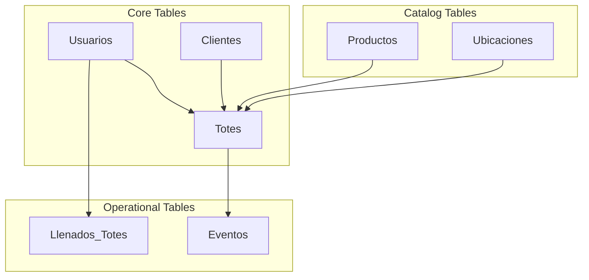
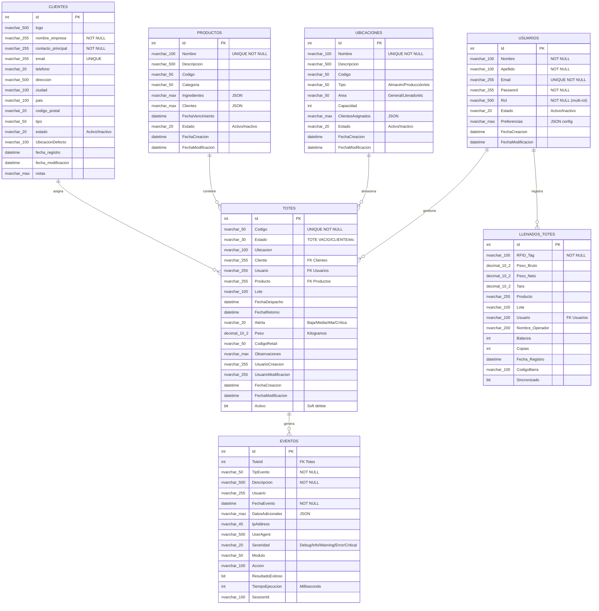

## Database Information

The DitzlerTotes system uses **Microsoft SQL Server 2016+** as its primary database management system.

- **Database Name:** `Ditzler`
- **Version:** 3.1
- **Character Set:** Unicode (NVARCHAR)
- **Collation:** SQL Server Default
- **Total Tables:** 7
- **Stored Procedures:** 7
- **Functions:** 3
- **Total Indexes:** 39+

## Architecture Overview

The database follows a relational model with the following core components:



## Entity Relationship Diagram



## Table Summary

| Table | Purpose | Records | Indexes | Key Features |
|-------|---------|---------|---------|-------------|
| **Usuarios** | User authentication and authorization | ~10-100 | 4 | Multi-role support, JSON preferences |
| **Clientes** | Customer/client management | ~50-500 | 6 | Logo storage, default locations |
| **Totes** | Container tracking and management | ~1,000-10,000 | 11 | Soft delete, retail codes, audit trail |
| **Llenados_Totes** | Fill operation history | ~10,000+ | 5 | RFID tracking, weight measurements |
| **Eventos** | System-wide audit log | ~100,000+ | 10 | Performance metrics, IP tracking |
| **Productos** | Product catalog | ~50-200 | 4 | Categories, ingredients, expiration |
| **Ubicaciones** | Location/warehouse zones | ~20-100 | 4 | Capacity tracking, area classification |

## Database Features

### Multi-Role Support
Users can have multiple roles assigned simultaneously, separated by commas:
```sql
UPDATE Usuarios 
SET Rol = 'Administrador, Operador de Llenado de Totes'
WHERE Email = 'usuario@ditzler.com';
```

### Soft Delete Pattern
The Totes table implements soft deletes using the `Activo` bit column, preserving historical data while marking records as inactive.

### JSON Storage
Several tables use `NVARCHAR(MAX)` columns to store JSON data:
- **Usuarios.Preferencias** - User UI preferences and settings
- **Eventos.DatosAdicionales** - Event metadata and context
- **Productos.Ingredientes** - Product ingredient lists
- **Productos.Clientes** - Assigned customer list
- **Ubicaciones.ClientesAsignados** - Location-specific customers

### Audit Trail
Comprehensive change tracking through:
- **FechaCreacion** and **FechaModificacion** timestamps
- **UsuarioCreacion** and **UsuarioModificacion** fields
- **Eventos** table for detailed operation logging

### Code Generation
Automatic code generation for:
- **Tote codes**: `TOTE-0001`, `TOTE-0002`, etc.
- **Retail codes**: `COD-000001`, `COD-000002`, etc.

## Performance Considerations

### Indexing Strategy
The database implements 39+ indexes across all tables to optimize:
- Primary key lookups
- Foreign key relationships
- Status and date-based queries
- Full-text search on key fields

### Query Optimization
Stored procedures are used for complex operations to:
- Reduce network traffic
- Improve execution plan caching
- Centralize business logic
- Enhance security through parameterization

## Data Integrity

### Foreign Key Relationships
- **Eventos.ToteId** → **Totes.Id** (ON DELETE SET NULL)
- Logical relationships through string matching for flexibility

### Constraints
- **UNIQUE** constraints on email addresses and codes
- **NOT NULL** constraints on required fields
- **DEFAULT** values for status fields and timestamps
- **CHECK** constraints for email validation (when enabled)

### Referential Integrity
The system uses a hybrid approach:
- Hard foreign keys for critical relationships (Events → Totes)
- String-based references for flexible associations (Totes → Clients, Products)

## Backup and Maintenance

### Recommended Maintenance Tasks

```sql
-- Verify database integrity
DBCC CHECKDB('Ditzler');

-- Clean up old events (365+ days)
EXEC SP_LimpiarEventosAntiguos @diasAntiguedad = 365;

-- Update statistics for query optimization
EXEC sp_updatestats;
```

### Backup Strategy
- **Full backups**: Daily
- **Differential backups**: Every 6 hours
- **Transaction log backups**: Every 15 minutes
- **Retention**: 30 days minimum

## Migration History

The database schema has evolved through several versions:

| Version | Date | Changes |
|---------|------|----------|
| **3.1** | 2026-01 | Added Areas, ClientesAsignados, CodigoRetail, Ingredientes |
| **3.0** | 2025-12 | Multi-role support, Preferencias, FechaRetorno |
| **2.0** | 2025-11 | Products and Locations tables, enhanced Events |
| **1.0** | 2025-10 | Initial schema with core tables |

## Database Objects Summary

### Programmable Objects
- **Stored Procedures:** 7 (see [Stored Procedures](/database/stored-procedures))
- **Functions:** 3 (see [Functions](/database/functions))
- **Triggers:** None currently implemented
- **Views:** None currently implemented

### Security
- **Authentication:** SQL Server Authentication
- **Password Storage:** Plain text (⚠️ should be migrated to bcrypt in application layer)
- **Connection Encryption:** Recommended TLS/SSL
- **User Isolation:** Role-based access control in application

## Connection Configuration

Example connection string for the application:

```javascript
const config = {
  user: process.env.DB_USER,
  password: process.env.DB_PASSWORD,
  server: process.env.DB_SERVER || 'localhost',
  database: 'Ditzler',
  port: parseInt(process.env.DB_PORT) || 1433,
  options: {
    encrypt: true,
    trustServerCertificate: true,
    enableArithAbort: true
  }
};
```

## Next Steps

<CardGroup cols={2}>
  <Card title="Table Definitions" icon="table" href="/database/tables">
    Detailed column definitions, constraints, and indexes
  </Card>
  <Card title="Stored Procedures" icon="code" href="/database/stored-procedures">
    Documentation for all stored procedures with examples
  </Card>
  <Card title="Functions" icon="function" href="/database/functions">
    SQL functions for code generation and validation
  </Card>
</CardGroup>
