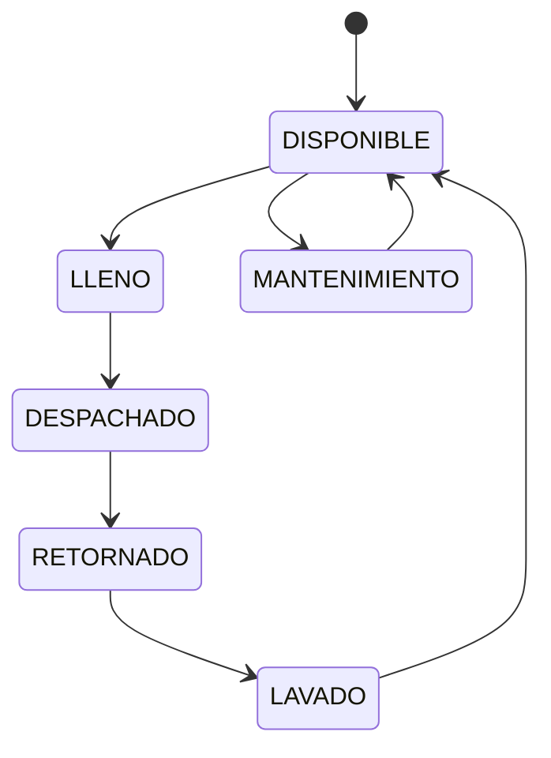

Tote management is the core feature of DitzlerTotes, providing complete tracking and control of tote containers throughout their lifecycle.

## Overview

The system tracks every aspect of tote operations including creation, filling, movement between locations, assignment to clients, maintenance, and eventual disposal.

<CardGroup cols={3}>
  <Card title="Lifecycle Tracking" icon="rotate">
    Track totes through all lifecycle stages
  </Card>
  <Card title="Status Management" icon="list-check">
    Six distinct states with validation rules
  </Card>
  <Card title="Location Tracking" icon="map-pin">
    Real-time location and movement history
  </Card>
  <Card title="Client Assignment" icon="user-tag">
    Link totes to clients and internal systems
  </Card>
  <Card title="Product Tracking" icon="flask">
    Track contents, batch numbers, and expiration
  </Card>
  <Card title="Weight Management" icon="weight">
    Record tare, net, and gross weights
  </Card>
</CardGroup>

## Tote Data Model

Totes are stored in the `Totes` table:

| Field | Type | Description |
|-------|------|-------------|
| **Id** | int | Primary key |
| **Codigo** | nvarchar(50) | Unique tote code (TOTE-####) |
| **Estado** | nvarchar(20) | Current state |
| **Ubicacion** | nvarchar(100) | Current location |
| **Cliente** | nvarchar(255) | Assigned client |
| **Usuario** | nvarchar(255) | Responsible user |
| **Producto** | nvarchar(255) | Product name |
| **Lote** | nvarchar(100) | Batch/lot number |
| **FechaEnvasado** | datetime | Filling date |
| **FechaVencimiento** | datetime | Expiration date |
| **FechaDespacho** | datetime | Dispatch date |
| **Alerta** | nvarchar(20) | Alert level |
| **Peso** | decimal(10,2) | Weight in kg |
| **Observaciones** | nvarchar(MAX) | Notes |
| **CodigoBarra** | nvarchar(50) | Barcode |
| **CodigoRetail** | nvarchar(50) | Retail tracking code |
| **FechaRetorno** | datetime | Expected return date |
| **Activo** | bit | Soft delete flag |

## Tote States

Totes progress through six states:



### State Descriptions

<AccordionGroup>
  <Accordion title="DISPONIBLE - Available">
    Tote is empty, clean, and ready for use. Can be assigned to filling operations.
  </Accordion>
  
  <Accordion title="LLENO - Filled">
    Tote has been filled with product and is awaiting dispatch or storage.
  </Accordion>
  
  <Accordion title="DESPACHADO - Dispatched">
    Tote has been sent to a client or moved to internal system (Retail, Helados, etc.).
  </Accordion>
  
  <Accordion title="RETORNADO - Returned">
    Empty tote has been returned from client and is awaiting washing.
  </Accordion>
  
  <Accordion title="LAVADO - Washed">
    Tote has been cleaned and is being prepared to return to DISPONIBLE.
  </Accordion>
  
  <Accordion title="MANTENIMIENTO - Maintenance">
    Tote requires repair, inspection, or is temporarily out of service.
  </Accordion>
</AccordionGroup>

## Core Operations

### Create Tote

Create a new tote in the system:

```bash
curl -X POST http://localhost:3000/api/admin/totes \
  -H "Content-Type: application/json" \
  -d '{
    "action": "create",
    "toteData": {
      "codigo": "TOTE-1234",
      "ubicacion": "Warehouse-A",
      "estado": "DISPONIBLE"
    }
  }'
```

<Info>
If you don't provide a codigo, the system generates one automatically using `FN_GenerarCodigoTote()`.
</Info>

### Fill Tote

Filling operators use the specialized interface:

```bash
curl -X PUT http://localhost:3000/api/operador/totes/update-status \
  -H "Content-Type: application/json" \
  -d '{
    "codigo": "TOTE-1234",
    "nuevoEstado": "LLENO",
    "producto": "Jarabe de Chocolate",
    "lote": "LOTE-240115",
    "peso": 285.5,
    "fechaEnvasado": "2024-01-15",
    "fechaVencimiento": "2024-07-15",
    "codigoBarra": "COD-000123",
    "usuario": "Juan Perez"
  }'
```

### Move Tote

Change tote location:

```bash
curl -X PUT http://localhost:3000/api/totes/mover \
  -H "Content-Type: application/json" \
  -d '{
    "codigo": "TOTE-1234",
    "nuevaUbicacion": "Production-Line-2",
    "operador": "Maria Lopez"
  }'
```

### Dispatch Tote

Send tote to client:

```bash
curl -X PUT http://localhost:3000/api/operador/totes/update-status \
  -H "Content-Type: application/json" \
  -d '{
    "codigo": "TOTE-1234",
    "nuevoEstado": "DESPACHADO",
    "cliente": "Distribuidora del Norte",
    "nuevaUbicacion": "En Transito",
    "usuario": "Carlos Garcia"
  }'
```

## Business Rules

The system enforces several business rules (from `services/totes.service.js`):

### Content Clearing

When a tote is moved to certain destinations, its content is cleared:

```javascript
// Destinations that clear content
const clearingDestinations = ['RESIDUOS', 'REPROCESO', 'LAVADO', 'MANTENIMIENTO'];

if (clearingDestinations.some(dest => nuevaUbicacion.toUpperCase().includes(dest))) {
  // Clear product, lote, peso, fechas
  updateFields.Producto = null;
  updateFields.Lote = null;
  updateFields.Peso = null;
  updateFields.FechaEnvasado = null;
  updateFields.FechaVencimiento = null;
}
```

### Internal Client System

The system recognizes five internal clients:

- **Retail** - Retail distribution (generates CodigoRetail)
- **Helados** - Ice cream production
- **Preparados** - Prepared products
- **Trasvase** - Transfer operations
- **Almacenamiento** - Storage

```javascript
const INTERNAL_CLIENTS = ['Retail', 'Helados', 'Preparados', 'Trasvase', 'Almacenamiento'];
```

### Retail Code Generation

When dispatched to Retail, a special tracking code is generated:

```javascript
if (cliente === 'Retail') {
  const codigoRetail = `RET-${Date.now()}`;
  // Stored in CodigoRetail field
}
```

## Batch Management

Batch/lot numbers follow the format `LOTE-XXXXXX`:

```bash
# Get last batch number
curl http://localhost:3000/api/operador/lote/last

# Generate next batch number
curl http://localhost:3000/api/operador/lote/next
```

Response:

```json
{
  "success": true,
  "lote": "LOTE-240116"
}
```

## Barcode System

Each filled tote gets a tracking barcode:

```bash
# Generate new barcode
curl http://localhost:3000/api/operador/barcode/generate
```

Response:

```json
{
  "success": true,
  "barcode": "COD-000124"
}
```

Barcodes use the format `COD-XXXXXX` generated by `FN_GenerarCodigoSeguimiento()`.

## Movement History

Track all tote movements:

```bash
curl "http://localhost:3000/api/movimientos?codigo=TOTE-1234"
```

Response:

```json
{
  "success": true,
  "movimientos": [
    {
      "Id": 523,
      "TipEvento": "Actualizacion",
      "Descripcion": "Tote TOTE-1234 moved from Warehouse-A to Production-Line-2",
      "Usuario": "Maria Lopez",
      "FechaEvento": "2024-01-15T14:30:00",
      "DatosAdicionales": {
        "ubicacionAnterior": "Warehouse-A",
        "ubicacionNueva": "Production-Line-2"
      }
    }
  ]
}
```

## Alert System

Totes can have four alert levels:

| Level | Description | Condition |
|-------|-------------|----------|
| **Baja** | Low priority | More than 7 days to expiration |
| **Media** | Medium priority | 3-7 days to expiration |
| **Alta** | High priority | 1-3 days to expiration |
| **Crítica** | Critical | Expired or expiring within 24 hours |

<Warning>
Totes with "Crítica" alert should be inspected immediately and either dispatched, used, or disposed of.
</Warning>

## Search and Filtering

Powerful search capabilities:

```bash
curl -X POST http://localhost:3000/api/admin/totes \
  -H "Content-Type: application/json" \
  -d '{
    "action": "search",
    "toteData": {
      "estado": "LLENO",
      "producto": "Jarabe",
      "cliente": "Distribuidora"
    }
  }'
```

Search supports:
- Estado (exact or partial match)
- Codigo (exact or partial)
- Cliente (partial match)
- Producto (partial match)
- Ubicacion (partial match)
- Date ranges (FechaEnvasado, FechaVencimiento)

## UI Features

The tote management interface (`pages/totes.html`) provides:

### Tote Table

- Color-coded status indicators
- Sortable columns
- Real-time search
- Advanced filters
- Pagination
- Export to CSV/Excel

### Tote Details

- Complete tote information
- Movement history timeline
- Associated client details
- Product and batch info
- Weight and dates
- Alert status
- Edit and delete options

### Quick Actions

- Create new tote
- Move tote
- Change status
- Print label/barcode
- View history
- Export data

## Performance Optimization

The system includes several optimizations:

```sql
-- Indexes on Totes table
CREATE INDEX IX_Totes_Codigo ON Totes(Codigo);
CREATE INDEX IX_Totes_Estado ON Totes(Estado);
CREATE INDEX IX_Totes_Cliente ON Totes(Cliente);
CREATE INDEX IX_Totes_Ubicacion ON Totes(Ubicacion);
CREATE INDEX IX_Totes_FechaVencimiento ON Totes(FechaVencimiento);
CREATE INDEX IX_Totes_Activo ON Totes(Activo);
```

<Tip>
For deployments with 10,000+ totes, consider partitioning the Eventos table by date to improve query performance.
</Tip>

## Related Documentation

<CardGroup cols={3}>
  <Card title="API: Totes" icon="code" href="/api/totes">
    Complete API reference
  </Card>
  <Card title="Tote Lifecycle" icon="rotate" href="/concepts/tote-lifecycle">
    Detailed lifecycle documentation
  </Card>
  <Card title="Filling Operator" icon="fill-drip" href="/operators/filling-operator">
    Filling workflow guide
  </Card>
  <Card title="Tote Operator" icon="dolly" href="/operators/tote-operator">
    Movement workflow guide
  </Card>
  <Card title="Dispatch Operator" icon="truck" href="/operators/dispatch-operator">
    Dispatch workflow guide
  </Card>
  <Card title="Products & Locations" icon="sitemap" href="/features/products-and-locations">
    Managing products and locations
  </Card>
</CardGroup>
