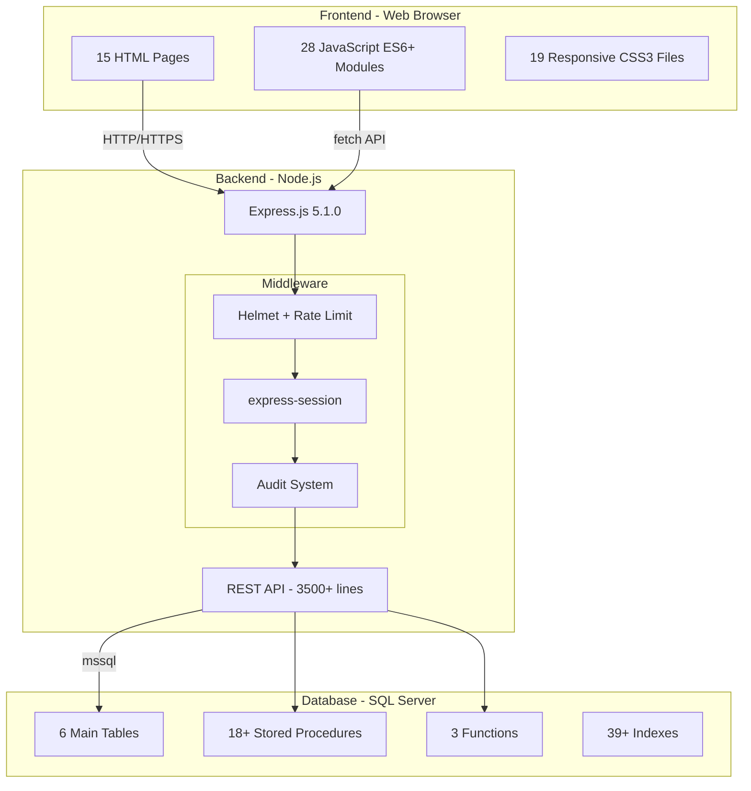
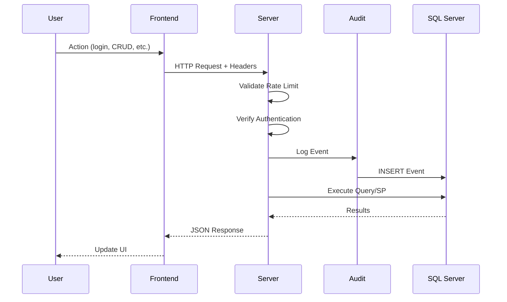

DitzlerTotes is a full-stack web application designed for comprehensive management of tote containers in production environments. The system provides complete traceability, real-time metrics, and specialized operator interfaces for managing the entire lifecycle of industrial containers.

## What is DitzlerTotes?

DitzlerTotes is an enterprise-grade container management system that covers:

- **Authentication and role management** - Multi-role user system with differentiated permissions
- **User and client management** - Complete CRUD operations with validation
- **Tote control** - States, locations, expiration dates, and alerts
- **Product management** - Product catalog with categories
- **Location management** - Control of storage zones and areas
- **Specialized operators** - Optimized interfaces for filling, dispatch, and operations
- **Movement history** - Complete traceability of tote movements
- **Dashboard with metrics** - Real-time KPI indicators
- **Alert system** - Notifications for expirations and errors
- **Centralized audit** - Complete logging of actions and events
- **User preferences** - Menu customization and configuration settings
- **Data export** - Record export functionality

## System architecture

The system is built using a modern, modular architecture:



## Technology stack

DitzlerTotes is built with industry-standard technologies:

| Layer | Technology | Version |
|-------|------------|----------|
| Frontend | HTML5, CSS3, JavaScript ES6+ | - |
| Backend | Node.js + Express | 5.1.0 |
| Database | Microsoft SQL Server | 2016+ |
| Security | Helmet, Express Rate Limit, bcrypt | 8.1.0, 8.2.1, 6.0.0 |
| Sessions | express-session | 1.18.2 |

### Core dependencies

The application relies on these key packages:

- **express** (5.1.0) - Web application framework
- **mssql** (11.0.1) - SQL Server client for Node.js
- **helmet** (8.1.0) - HTTP security headers
- **bcrypt** (6.0.0) - Password hashing
- **express-rate-limit** (8.2.1) - Rate limiting middleware
- **express-session** (1.18.2) - Session management
- **dotenv** (17.2.3) - Environment variable management
- **jsonwebtoken** (9.0.3) - JWT token handling

## Key features

<CardGroup cols={2}>
  <Card title="Multi-role system" icon="users">
    Support for multiple roles per user including administrators, viewers, and specialized operators
  </Card>
  <Card title="Real-time tracking" icon="chart-line">
    Live KPI dashboard with tote status, availability metrics, and active alerts
  </Card>
  <Card title="Complete traceability" icon="clock-rotate-left">
    Full audit trail of all operations, movements, and state changes
  </Card>
  <Card title="Specialized interfaces" icon="tools">
    Purpose-built operator panels for filling, dispatch, and tote management
  </Card>
</CardGroup>

## Data flow

Here's how data flows through the DitzlerTotes system:



<Note>
All user actions are automatically logged to the centralized audit system, including IP addresses, user agents, and detailed before/after data for modifications.
</Note>

## Role-based access

The system supports five distinct roles:

| Role | Access Level | Description |
|------|--------------|-------------|
| Administrator | Full dashboard | Complete system access with all permissions |
| Viewer | Dashboard (read-only) | View information without modification rights |
| Tote Operator | Tote operator panel | Tote management and movement operations |
| Dispatch Operator | Dispatch operator panel | Dispatch control and client assignment |
| Filling Operator | Filling operator panel | Tote filling and product assignment |

<Tip>
Users can be assigned multiple roles simultaneously. For example, a user can be both an Administrator and a Filling Operator, allowing them to access both the full dashboard and the specialized filling interface.
</Tip>

## Security features

DitzlerTotes implements multiple layers of security:

- **HTTP security headers** via Helmet middleware
- **Rate limiting** to prevent abuse (configurable per endpoint)
- **Password hashing** using bcrypt with salt rounds
- **Secure session management** with express-session
- **Input validation** and sanitization
- **Audit logging** of all security-relevant events
- **IP tracking** and user agent logging

## Database structure

The system uses a normalized SQL Server database with these main tables:

- **Usuarios** - User accounts with preferences and multi-role support
- **Clientes** - Client companies with contact information
- **Totes** - Container records with states and traceability
- **Llenados_Totes** - Filling history and weight records
- **Eventos** - Centralized audit log and event tracking
- **Productos** - Product catalog with categories
- **Ubicaciones** - Storage locations with capacity tracking

## Project structure

The codebase follows a modular architecture:

```
DitzlerTotesDB/
├── server.js              # Express server with 3500+ lines of API
├── package.json           # Dependencies and scripts
├── .env.example           # Environment variable template
├── pages/                 # 15 HTML pages
├── js/                    # 28 JavaScript modules
├── css/                   # 19 CSS stylesheets
├── middleware/            # Audit and security middleware
├── routes/                # Modular route definitions
├── controllers/           # HTTP controllers
├── services/              # Business logic layer
├── config/                # Database and app configuration
├── utils/                 # Helper functions
└── database/              # 13 SQL scripts
```

## Use cases

DitzlerTotes is designed for:

1. **Production facilities** - Managing reusable containers in manufacturing environments
2. **Food processing** - Tracking containers with products like syrups, oils, essences, and sweets
3. **Warehouse management** - Controlling container locations and availability
4. **Quality control** - Monitoring expiration dates and product batches
5. **Client operations** - Assigning containers to specific clients and tracking dispatch

## Next steps

<CardGroup cols={2}>
  <Card title="Quick start" icon="rocket" href="/quickstart">
    Get DitzlerTotes up and running in minutes
  </Card>
  <Card title="Installation" icon="download" href="/installation">
    Detailed setup instructions for production deployment
  </Card>
</CardGroup>